# DMs for Segmentation 论文串烧

Author: <a href="https://yusijin02.github.io/">Sijin Yu</a>

[TOC]

# 1. 用 Bernoulli 噪音的 DM 用于医学图像分割

[1] Tao Chen, Chenhui Wang, Hongming Shan. *BerDiff: Conditional Bernoulli Diffusion Model for Medical Image Segmentation*. MICCAI, 2023.

## 1.0 Abstract

- 医学图像分割是一个具有挑战性的任务, 它有内在的模糊性和很高的不确定性, 导致一些不清楚的肿瘤界限和多种看似合理的标注等事实.
- 对于分割的掩码而言, **准确性**和**多样性**都是很重要的, 以对放射科医生在临床实践中给出有价值的参考.
- 尽管现有的扩散模型 (Diffusion Model) 在各种视觉生成任务中展现其强大的能力, 在分割中处理分离的掩码依然很具有挑战性.
- 为了在图像分割掩码中达到高准确性和多样性, 我们为医学图像分割提出一种新式的**条件伯努利扩散模型 (conditional Bernoulli Diffusion model, DerDiff)**.
- 我们首先提出使用**伯努利噪音 (Bernoulli noise)** 取代高斯噪音 (Gaussian noise) 作为扩散核 (diffusion kernel) 以增加扩散模型对二进制分割问题的能力, 以获得更高的分割准确性.
- 其次, 通过利用扩散模型的随机性, 我们的 BerDiff 模型**多次随机采样伯努利噪音和中间的隐藏变量**以获得各种各样的分割掩码, 这可以突出感兴趣的区域并为医生提供宝贵的参考.
- 此外, 我们的 BerDiff 模型可以有效地从反向扩散的轨迹中采样子序列, 以加速分割过程.
- 在两个不同模态的医学图像分割数据集上的大量实验结果证明了我们的 BerDiff 打败了其它模型, 并获得了 SOTA.
- 我们的结果证明了扩散模型可以作为医学图像分割的强大骨架模型.

## 1.1 Model

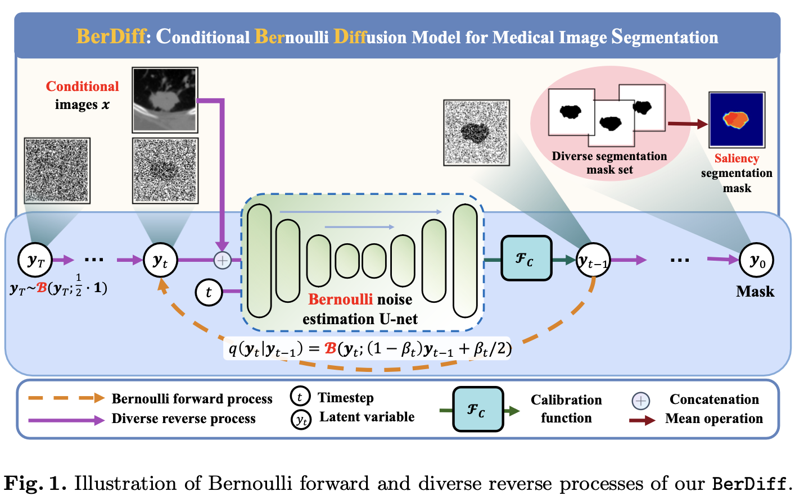

### 1.1.1 Problem Definition

- $x\in\mathbb R^{H\times W\times C}$ 表示输入的图像. $H\times W$ 表示分辨率. $C$ 表示通道数.

- ground-truth mask 表示为 $y_0\in\{0,1\}^{H\times W}$. $0$ 表示背景, $1$ 表示 ROI.

- 伯努利扩散模型 (Bernoulli Diffusion Model) 可表示为:
  $$
  p_{\theta}(y_0|x)=\int p_{\theta}(y_{0:T})\text dy_{1:T}
  $$
  其中, 初始化的伯努利噪音 (Bernoulli Noise) 为
  $$
  y_T\sim\mathcal B(y_T;\frac12\cdot\textbf1)
  $$

### 1.1.2 Framework of Diffusion Model

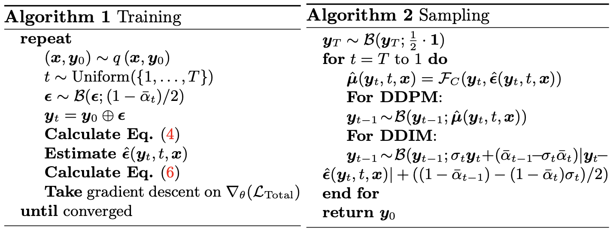

- **伯努利前向过程 (Bernoulli Forward Process)** 是一个马尔可夫链 (Markov Chain), 表示如下:
  $$
  q(y_{1:T}|y_0):=\prod_{t=1}^T q(y_t|y_{t-1})
  $$

  $$
  q(y_t|y_{t-1}):=\mathcal B(y_t;(1-\beta_t)y_{t-1}+\beta_t/2)
  $$

  令 $\alpha_t = 1-\beta_t$, 和 $\bar \alpha_t=\prod_{\tau=1}^t\alpha_{\tau}$, 可以得到任意时间步 $t$ 的样本 $y_t$ 的分布为:
  $$
  q(y_t|y_0)=\mathcal B(y_t;\bar\alpha_t y_0+(1-\bar\alpha_t)/2)
  $$
  **为了保证目标函数可导**, 采样 $\epsilon\sim\mathcal B(\epsilon;\frac{1-\bar\alpha}{2}\cdot\textbf 1)$, 并且令 $y_t=y_0\otimes\epsilon$, 其中 $\otimes$ 为异或 (XOR) 操作. **请注意这是等价的**.

- **伯努利后验概率 (Bernoulli Posterior Probability)** 可以被表示为:
  $$
  q(y_{t-1}|y_t,y_0)=\mathcal B(y_{t-1};\theta_{post}(y_t, y_0))
  $$
  其中, $\theta_{post}(\cdot)$ 为:
  $$
  \theta_{post}(y_t,y_0)=Norm\left([\alpha_t[1-y_t,y_t]+\frac{1-\alpha_t}2]\odot\bar\alpha_{t-1}[1-y_0,y_0]+\frac{1-\bar \alpha_{t-1}}{2}\right)
  $$
  其中, $\odot$ 表示各元素相乘, $Norm(\cdot)$ 表示在 channel 维度上做归一化.

- **伯努利反向过程 (Bernoulli Reverse Process)** 可以表示为:
  $$
  p_{\theta}(y_{0:T}|x):=p(y_T)\prod_{t=1}^Tp_{\theta}(y_{t-1}|y_t,x)
  $$

  $$
  p_{\theta}(y_{t-1}|y_t, x):=\mathcal B(y_{t-1};\hat\mu(y_t,t, x))
  $$

  其中, 使用 $y_t$ 的估计伯努利噪音 $\hat\epsilon(y_t, t, x)$, 通过一个标函数 $\mathcal F_C$ 来参数化 $y_t$ 的估计均值 $\hat\mu(y_t,t, x)$, 即
  $$
  \hat\mu(y_t, t, x)=\mathcal F_C(y_t,\hat\epsilon(y_t, t, x))=\theta_{post}(y_t,|y_t-\hat\epsilon(y_t, t, x|)
  $$

### 1.1.3 Loss Function

- **KL 损失**, 用于拉近后验概率和反向过程的距离
  $$
  \mathcal L_{KL}=\mathbb E_{q(x, y_0)}\mathbb E_{q(t_t|y_0)} \left[
  D_{KL}[q(y_{t-1}|y_t, y_0)||p_\theta(y_{t-1}|y_t, x)]
  \right]
  $$

- **二分类交叉熵损失**, 用于拉近噪音估计和标准伯努利分布的距离
  $$
  \mathcal L_{BCE}=-\mathbb E_{(\epsilon,\hat\epsilon)}\sum_{(i, j)}^{H,W}[
  \epsilon_{(i, j)}\log\hat\epsilon_{(i, j)}+(1-\epsilon_{i, j})\log(1-\hat\epsilon_{i,j})
  ]
  $$

最后, 
$$
\mathcal L_{total} = \mathcal L_{KL}+\lambda_{BCE}\mathcal L_{BCE}
$$

## 1.2 Experiment

### 1.2.1 Dataset & Preprocessing

- **LIDC-IDRI [2, 3]**. 包括 1018 张肺部 CT 扫描照片和分割掩码标注. 用于**横向对比**和**消融实验**. 被 resized 到 $128\times 128$.
- **BRATS 2021 [4]**.  对每个病人包括四种不同的 MRI 序列: T1, T2, FIAIR, T1CE. 用于**横向对比**. 被 resized 到 $224\times224$.

### 1.2.2 消融实验

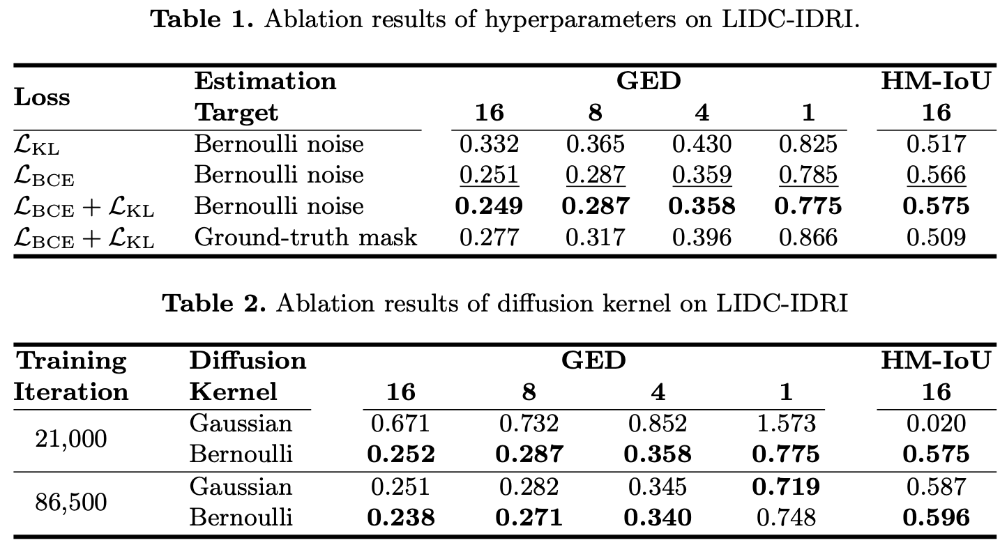

- 表 1 展示了不同损失函数和目标函数的影响. 

- 表 2 展现了使用高斯噪音和伯努利噪音的影响.

### 1.2.3 横向对比

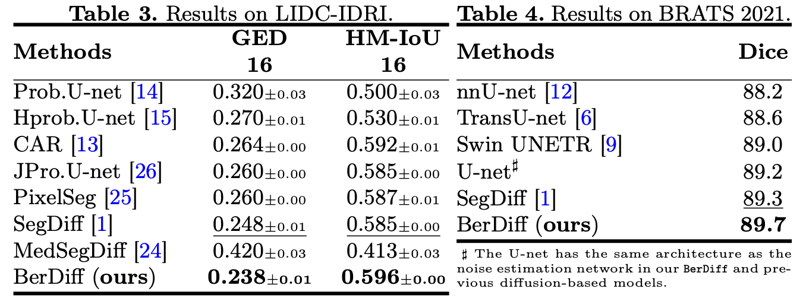

- 表 3 展示了在 LIDC-IDRI 上的横向对比.
- 表 4 展示了在 BRATS 2021 上的横向对比.

---

 

# 2. 使用类别引导的 CDM 进行弱监督分割

[5] Xinrong Hu, Yu-Jen Chen, Tsung-Yi Ho, Yiyu Shi. *Conditional Diffusion Models for Weakly Supervised Medical Image Segmentation*. MICCAI, 2023.

## 2.0 Abstract

- 最近, 降噪扩散概率模型在图像生成任务上取得了巨大的成功.
- 尽管已经存在不少工作去探索这一强大的工具在图像语义分割上的潜力, 然而它在**弱监督语义分割 (Weakly Supervised Semantic Segmentation, WSSS)** 上的应用仍欠探索.
- 我们观察到**条件扩散模型 (Conditional Diffusion Model, CDM)** 在特定分布上生成图像的强大能力, 在这一份工作里, 我们利用 CDM 在底层对类别感知的语义信息, 去预测一张**仅有图像层面标注的**图像的分割掩码.
- 更具体地, 我们通过**近似 CDM 的输出相对于输入条件的导数**来**定位所需的类别**.
- 我们的方法与先前**使用外部分类器引导**的扩散模型方法不同, 它们在**重建的过程中会累计背景的噪音**.
- 我们的方法在两个公开的医学影像分割数据集上表现得比 SOTA CAM 和其它扩散模型更好, 这证明了 CDM 在 WSSS 的前景.
- 并且, 实验证明我们的方法比现有的扩散模型方法时间上更高效, 使它在广泛的应用上更加有用.

## 2.1 Motivation & Contribution

### 2.1.1 Motivation

- 医学图像分割对于疾病诊断、治疗规划和异常监测至关重要.
- 弱监督语义分割 (WSSS) 由于大大降低了像素级标注的成本, 因此在医学图像社区中引起了重要关注.
- 目前的 WSSS 工作主要由类激活图 (CAM) 及其变体主导, 但存在一定的局限性.

### 2.1.2 Contribution

- 本研究提出了一种新型的 WSSS 框架, 使用条件扩散模型 (CDM), 基于不同条件下预测噪声的差异.
- 通过计算不同阶段预测噪声的导数, 我们的方法突出相关对象, 减少背景误识别.
- 我们的方法不需要完整的逆向去噪过程, 推理时间与基于 CAM 的方法相当, 且在两个不同任务上展示了最先进的性能.

## 2.2 Model

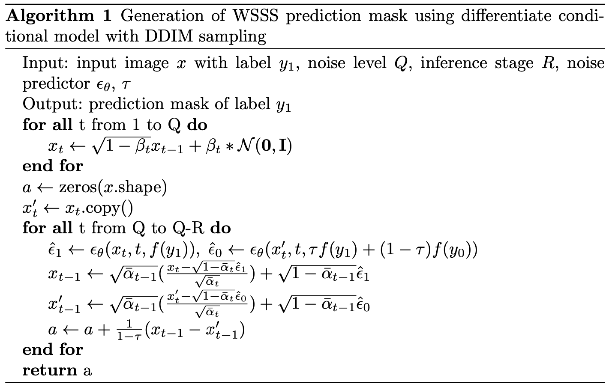

### 2.2.1 Training Conditional Denoising Diffusion Model

- 设在分布 $D(x|y)$ 中采样了一个样本 $x_0$. $x_0$ 表示一个图像.

  $y$ 是条件, 它可以是各种各样的, 可以包括图像不同的模态、风格、分辨率. 在这份工作中, $y\in\{y_0, y_1\}$ 表示图像的二分类标签 (例如脑部 CT 扫描里的是否有肿瘤).

  其中, $y$ 的输入是一个可学习的 embedding $e=f(y), f\in\mathbb R\to\mathbb R^n$

- **前向过程**可以表示为马尔可夫链:
  $$
  q(x_t|x_{t-1},y):=\mathcal N(x_t|y;\sqrt{1-\beta_t}x_{t-1}|y,\beta_t\cdot\textbf 1)
  $$
  令 $\alpha_t:=1-\beta_t$ 和 $\bar\alpha_t:=\prod_{\tau=1}^t\alpha_{\tau}$, 给定 $x_0$, 可以直接得到 $x_t$:
  $$
  q(x_t|x_0,y):=\mathcal N(x_t|y;\sqrt{\bar\alpha_t}x_0|y,(1-\bar\alpha_t)\cdot\textbf 1)
  $$

- 训练一个 U-Net $\epsilon_{\theta}(x,t,y)$ 去近似**反向过程**:
  $$
  p_{\theta}(x_{t-1}|x_t,y):=\mathcal N(x_{t-1};\mu_{\theta}(x_t, t, y),\Sigma_{\theta}(x_t, t, y))
  $$

- 将 $x_t$ 用标准高斯分布 $\epsilon\sim\mathcal N(\textbf 0,\textbf 1)$ **重参数化**:
  $$
  x_t=\sqrt{\bar\alpha_t}x_0 + \sqrt{1-\bar\alpha_t}\epsilon
  $$

- **损失函数**为:
  $$
  L:=\mathbb E_{x_0, \epsilon} ||
  \epsilon-\epsilon_{\theta}(x_t, t, y)
  ||
  $$

### 2.2.2 Gradient Map w.r.t Condition

通过 $x_{t}$ 复原 $x_{t-1}$ 可以通过:
$$
x_{t-1}(x_t, t, y)=\sqrt{\bar\alpha_{t-1}}\left(
\frac{x_t-\sqrt{1-\bar\alpha_t}\hat\epsilon(x_t, y)}{\sqrt{\bar\alpha_t}}
\right)+\sqrt{1-\bar\alpha_{t-1}}\hat\epsilon_{\theta}(x_t, y)
$$
$x_{t-1}(x_t, t, y)$ 对 $y$ 的偏微分 $\frac{\partial x_{t-1}}{\partial y}$ 可以通过下式计算
$$
\left.\frac{\partial x_{t-1}(x_t, t, y)}{\partial y}\right|_{y=y_1}=\lim_{\tau\to1}\frac{x_{t-1}(x_t, t, f(y_1))-x_{t-1}(x_t, t, \tau f(y_1)+(1-\tau)f(y_0))}{1-\tau}
$$
在实验中, 取 $\tau=0.95$.

## 2.3 Experiment

### 2.3.1 Dataset & Preprocessing

- **BraTS (脑肿瘤 MRI 分割) [6]**. 包含 2000 张四种不同 MRI 模态的 3D 脑扫描, 和肿瘤的分割标注. 用于**横向对比**和**消融实验**.
- **CHAOS (肾器官分割) [7]**. 包含 20 张 T2-SPIR 核磁腹部扫描. 用于**横向对比**.

### 2.3.2 横向对比

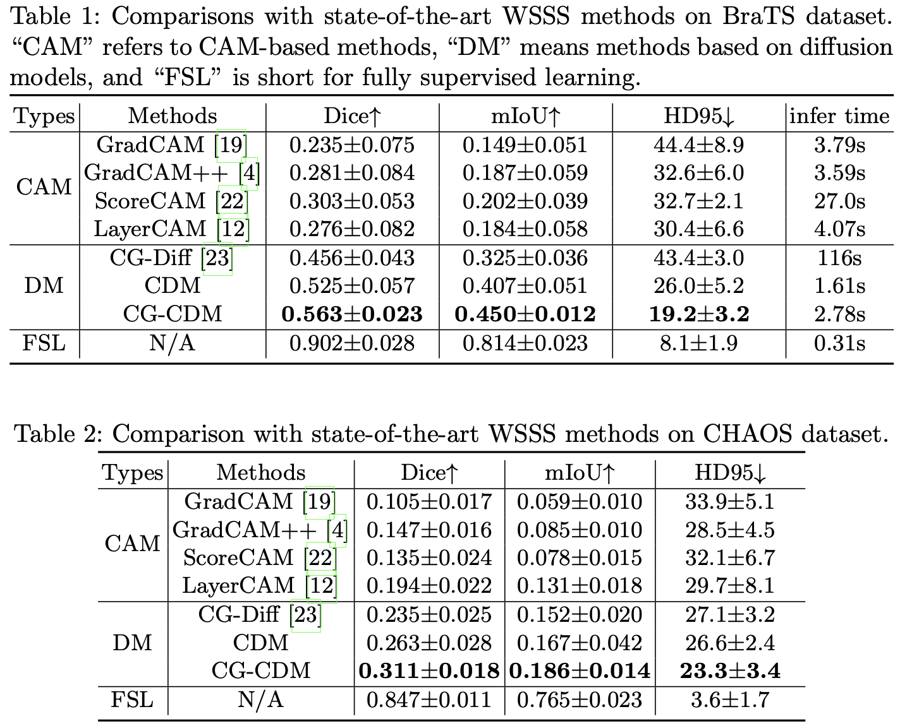

表 1 是在 BraTS 上的横向对比, 表 2 是在 CHAOS 上的横向对比.

### 2.3.3 消融实验

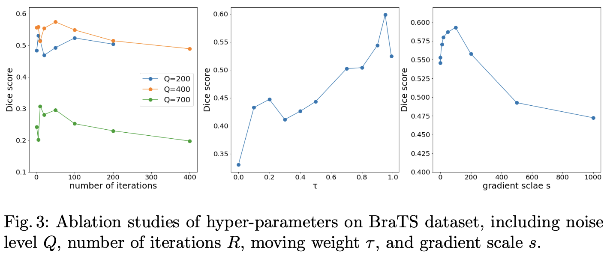

图为主要超参数的消融实验结果.

---

# 3. 使用 DM 的血液动力学对比增强 MRI 生成的 feature map 引导分割

[8] Tianxu Lv, Yuan Liu, Kai Miao, Lihua Li, Xiang Pan. *Diffusion Kinetic Model for Breast Cancer Segmentation in Incomplete DCE-MRI*. MICCAI, 2023.

## 3.0 Abstract

- 最近在**动态对比增强核磁共振成像 (Dynamic Contrast Enhanced Magnetic Resonance Imaging, DCE-MRI)**对**肿瘤分割**的研究通常借助**时间动力学特征 (Temporal Kinetic Characteristics)** 和深度学习的结合来提高分割性能.
- 然而, 获取完整的时间序列数据是困难的, 尤其是后对比增强图像 (Post-Contrast Images), 这使现有方法的分割性能、泛化能力、临床应用面临挑战.
- 在这一份工作中, 我们提出一种**扩散动力学模型 (Diffusion Kinetic Model)**, 它可以隐含地**利用 DCE-MRI 中的血液动力学先验信息**, 并且能够在仅需要前对比增强图像的情况下有效地生成高质量的分割图.
- 我们特别考虑了**血液动力学响应函数 (Hemodynamic Response Function, HRF)** 与**降噪扩散过程 (Denoising Diffusion Process, DDP)** 之间的潜在关系, 这对于逼真的图像生成展现出显著的效果.
- 我们提出的 DKM 包括一个**扩散模块 (Diffusion Module)** 和一个**分割模块 (Segmentation Module)**, 以使得 DKM 能够学习**癌症的血液动力学信息**, 并提供动力学的隐空间编码以促进分割性能.
- 一旦 DM 被预训练, 从 DM 中估计得到的潜在编码被简单地整合到 SM 中, 这使得 DKM 能够在仅使用前对比增强图像的情况下, 自动切准确地标注癌症.
- 据我们所知, 这是第一项研究探索了在动态 MRI 分割中 HRF 和 DDP 之间关系的工作.
- 我们在公开的乳腺癌 DCE-MRI 数据集上评估了我们所提出的肿瘤分割方法.
- 与使用完整序列的现有最先进方法相比，我们的方法即使在使用前对比增强图像时也能获得更高的分割性能.

> **什么是 DCE-MRI, 以及什么是 pre-contrast images 和 post-contrast images?**
>
> **ChatGPT**: 在动态对比增强磁共振成像（DCE-MRI）中，"pre-contrast images" 和 "post-contrast images" 指的是MRI扫描中的不同图像获取阶段，特别是在使用对比剂的情况下。
>
> 1. **前对比图像（Pre-Contrast Images）：** 这些图像是在注射对比剂之前获取的。前对比图像用作基准，并通常用于解剖参考，以提供与对比剂注射后获取的图像进行比较的基准点。它们有助于评估对比增强前组织的特征。
> 2. **后对比图像（Post-Contrast Images）：** 这些图像是在将对比剂注入患者的血液后获取的。对比剂突出显示了血管和各种组织内的血流分布。后对比图像显示了对比剂在组织内的摄取和分布方式，并有助于评估灌注、血管化和病变或异常的存在。这些图像用于跟踪组织特征的变化，评估对比增强的影响。
>
> DCE-MRI通常用于医学影像学，用于评估各种疾病，包括肿瘤特征化、血管化评估和组织灌注的评估。前对比和后对比图像在提供有关诊断和治疗规划的宝贵信息方面发挥着关键作用。

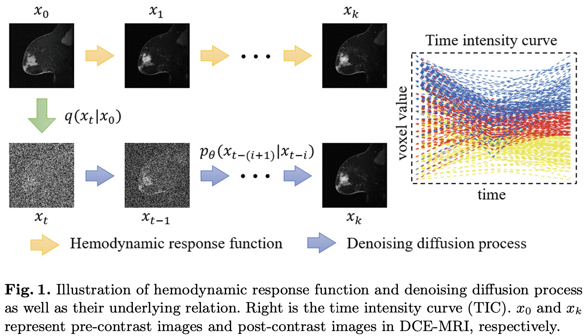

上图左边表示血液动力图响应函数和 Denoising Diffusion Process 之间的关系, 右边表示体素级别的强度随时间的变化.

[⚠️注: 这里, $x_0, x_1, \cdots,x_k$ 是 DCE-MRI 扫描的图片的过程, $x_0\to x_t$ 是扩散模型的前向过程, $x_t\to x_{t-1}\to\cdots\to x_k$ 是扩散模型的反向过程, 即扩散模型的任务是: 给定前对比图像 $x_0$, 生成后对比图像 $x_k$.]

## 3.1 Model

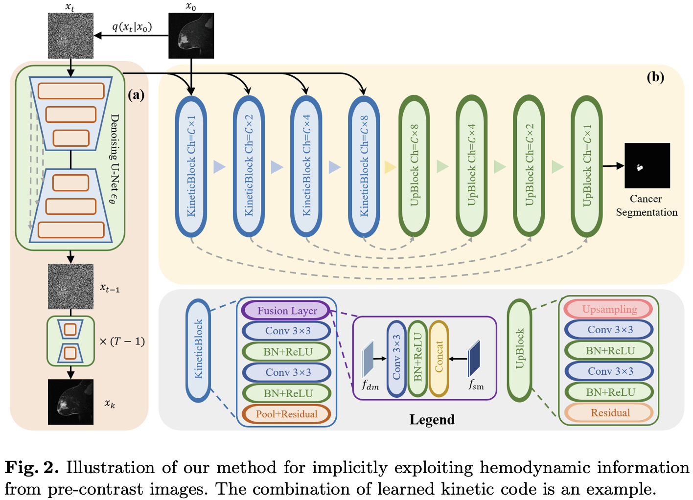

模型分为 **Diffusion Module** (图中 a) 和 **Segmentation Module** (图中 b).

**Diffusion Module** 为经典的 DDPM, 以前对比图像 $x_0$ 到高斯噪音 $x_t$ 为前向过程, 以高斯噪音 $x_t$ 到 $x_0$ 为反向过程. DM 被预训练后, DM 中间的隐藏输出 $f_{dm}$ 就包含了血液动力学响应函数的信息.

**Segmentation Module** 由前四层 **KineticBlock** 和后四层 **UpBlock** 组成.

**KineticBlock** 同时以 DM 的隐藏输出 $f_{dm}$ 和上一层 KineticBlock 的输出 $f_{sm}$ 为输入, 通过一个 **Fusion Layer** 融合它们:
$$
\hat f=Fusion(f_{dm}, f_{sm})= Concat(ReLU(BN(W*f_{dm}));f_{sm})
$$

## 3.2 Experiment

### 3.2.1 Dataset & Preprocessing

- **Breast-MRI- NACT-Pilot [9]**. 包括 64 位病人的乳腺癌对比增强 MRI.

### 3.2.2 横向对比

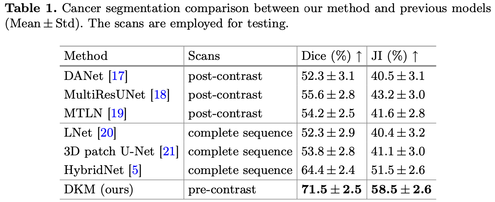

### 3.2.3 消融实验

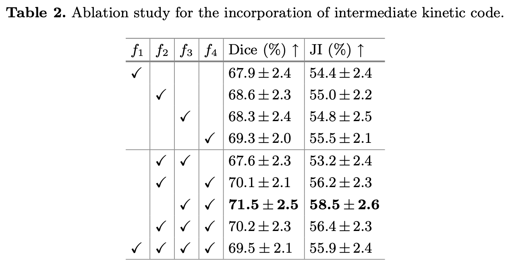

$f_i$ 表示 DM 的第 $i$ 阶段的 feature map.

---

# 4. 魔改 DM 中 U-Net 的输入和结构的医学图像分割

[11] G. Jignesh Chowdary, Zhaozheng Yin. *Diffusion Transformer U-Net for Medical Image Segmentation*. MICCAI, 2023.

## 4.0 Abstract

- **扩散模型 (Diffusion Model)** 已经在各种生成任务上展现出其威力.
- 当应用扩散模型进行医疗图像分割时, 需要克服一些障碍: 用于条件扩散过程的**语义特征与嵌入噪声不够匹配**; 而这些扩散模型中采用的 **U-Net** 主干对于反向扩散过程中对于准确的**像素级分割**至关重要的**上下文信息**不够敏感.
- 为了解决这些问题, 我们提出了一个用于增强来自源图像条件信息的**互注意力模块 (cross-attention module)**, 以及一个拥有用于提取不同尺寸上下文信息的**多尺度窗 (Multi-Size Windows)** 的 **基于 Transformer 的 U-Net**.
- 我们在 Kvasir-Seg, CVC Clinic DB, ISIC 2017, ISIC 2018, 和 Refuge 这五个有不同模态的图像的 benchmark 数据集上的实验发现, 我们的 **Diffusion Transformer U-Net** 拥有很好的泛化性能, 并且打赢了这些数据集上的所有 SOTA 模型.

## 4.1 Model

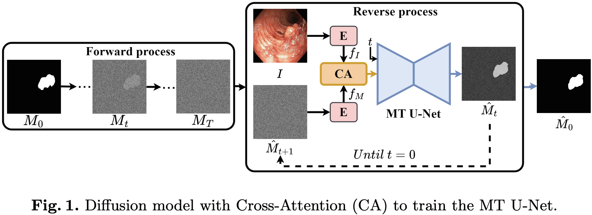

- 正向过程: 将 ground truth 的分割标注 $M_0$ 通过 $T$ 次加噪变为 $M_T$.
- 反向过程 (对于时间步 $t$): 
  - 给定图像 $I$, 通过 Encoder, 得到 embedding $f_I\in\mathbb R^{h\times w\times c_1}$.
  - 给定上一时间步带噪音的掩码输出 $\hat M_{t+1}$, 通过 Encoder, 得到 embedding $f_M \in\mathbb R^{h\times w\times c_2}$.
  - 两个 embedding 通过 Cross Attention 融合为一个 embedding, 和时间步 $t$ 一起作为 UNet 的输入.

### 4.1.1 Cross Attention

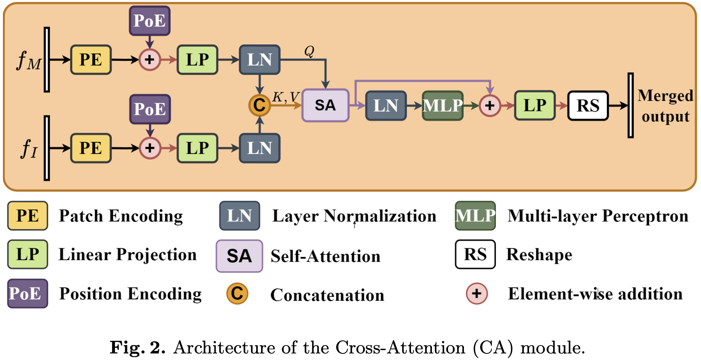

最后的输入被 reshape 成和 $f_M$ 一样的形状.

### 4.1.2 Multi-sized Transformer U-Net

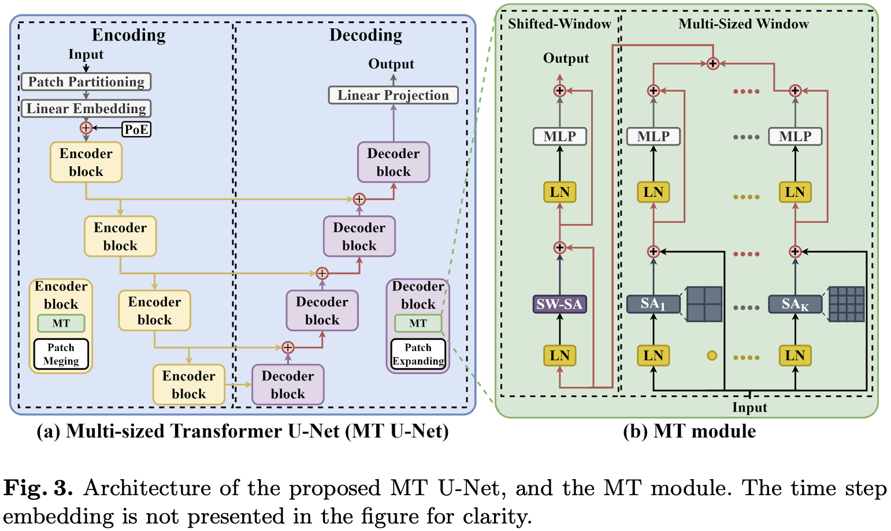

U-Net 的组成是 Multi-sized Transformer.

input 先通过 Multi-sized window 的 Transformer, 一共有 $K$ 条路, 所有路的加和进入 Shifted window, 得到 output.

## 4.2 Experiment

### 4.2.1 Dataset

- **Kvasir-SEG [12]** 结肠镜息肉分割.
- **CVC-Clinic DB [13]** 结肠镜息肉分割.
- **ISIC 2017 [14]** 皮肤镜皮肤病分割.
- **ISIC 2018 [15]** 皮肤镜皮肤病分割.
- **REFUGE [16]** 视网膜底片图像的视杯分割.

### 4.2.1 消融实验

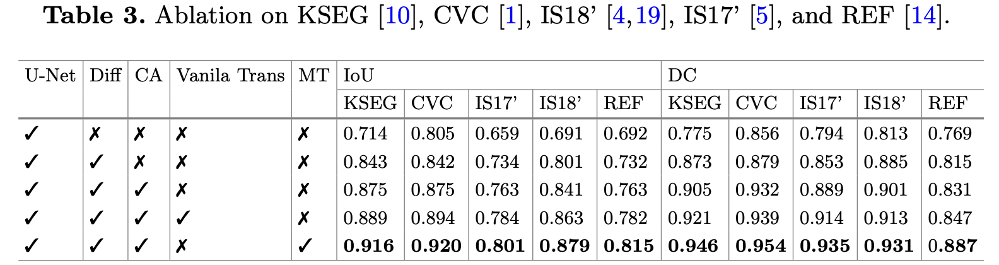

### 4.2.2 横向对比

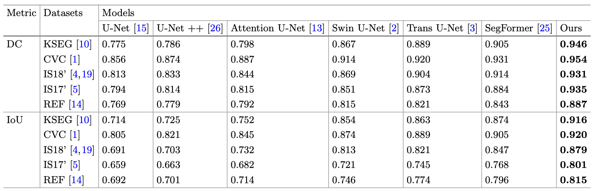

---

# 5. 使用 DM 做数据增强以提高分类性能

[17] Xinyi Yu, Guanbin Li, Wei Lou, Siqi Liu, Xiang Wan, Yan Chen, and Haofeng Li. *Diffusion-Based Data Augmentation for Nuclei Image Segmentation*. MICCAI, 2023.

## 5.1 Abstract

- 细胞核分割是病理学影像定量分析中一个重要但是充满挑战的任务.
- 尽管完全监督的基于深度学习的方法已经有了巨大进步, 但它们还是需要大量的**有标注图像**才能达到很好的分割性能.
- 考虑到人工标注一个数据集里的所有细胞核实例是十分低效的, 并且得到一个大规模的人工标注数据集是浪费时间的、浪费劳动力的. 因此, 仅使用少量标注图像去增强一个数据集以提高分类性能是一个意义重大切具有应用价值的研究.
- 在这篇文章中, 我们引入了第一个**基于扩散 (diffusion-based)** 的增强方法, 用于细胞核分割.
- 这一想法是**生成大量的有标注图像**, 以促进分割模型的训练.
- 为了达到这一目的, 我们提出了一个**两步策略**.
- 在第一步中, 我们训练一个**无条件的扩散模型 (unconditional diffusion model)** 去生成**核结构 (Nuclei Structure)**, 这被定义为**像素级语义和距离变换表示**.
- 每一个生成的**核结构**将作为**对组织病理学图像合成的约束**, 并进一步后处理为一个实例图.
- 在第二步中, 我们训练一个**条件扩散模型 (conditional diffusion model)**, 基于**核结构**去生成病理学图像.
- 生成的病理学图像将被加入到真实的数据集中并训练分割模型.
- 实验结果表明, 通过将合成样本增加到标记的真实数据集中的 10%, 可以达到与完全监督 baseline 相当的分割结果.

## 5.2 Motivation & Contribution

### 5.2.1 Motivation

- 细胞核分割在医学图像分析中至关重要, 有助于促进临床诊断和预诊断.
- 现有方法大多依赖大量标记图像, 但手动标记耗时且需要专业知识.
- 需要探索少量标记图像是否可以拓展训练数据集, 以达到或超过完全监督的分割性能.
- 与 GANs 相比, 基于扩散的模型提供了一个生成多样化图像的替代方案, 适合用于数据增强.

### 5.2.2 Contribution

- 提出了一种新颖的基于扩散的细胞核分割增强框架, 包括两个步骤: **无条件细胞核结构合成**和**有条件组织病理学图像合成**.
- 开发了一个无条件的扩散模型, 和一个以细胞核结构为条件的扩散模型.
- 实验表明, 仅用这一方法增强 10% 的标记训练数据, 就可以达到与完全监督方法相当的结果.

## 5.3 Model

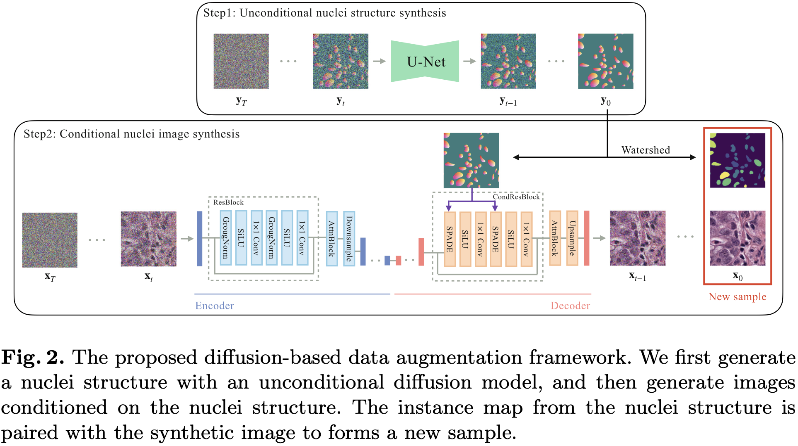

生成模型由两个步骤组成:

- Unconditional Nuclei Structure Synthesis (无条件的细胞核结构生成)
- Conditional Histopathology Image Synthesis (有条件的病理学图像生成)

### 5.3.1 Unconditional Nuclei Structure Synthesis

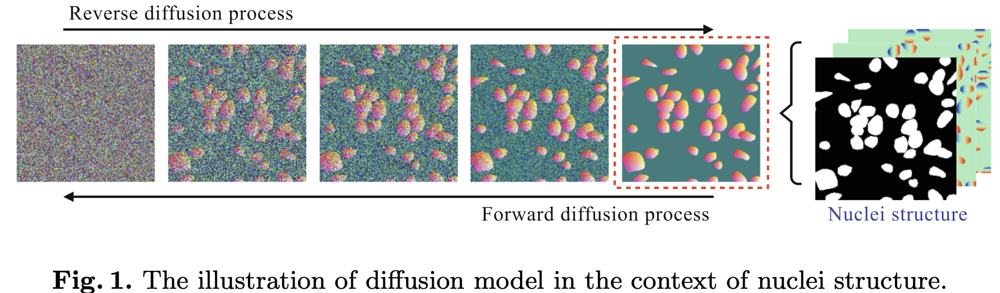

Nuclei Structure 由 **pixel-level semantic (像素级别语义)** 和 **distance transform (距离变换)** 两部分组成.

- **像素级别语义 (pixel-level semantic)** 是一个 mask 图, 只有 0 和 1, 表示一个像素是否属于细胞核.
- **距离变换 (distance transform)** 包括: **水平距离变换 (horizontal distance transform)** 和 **垂直距离变换 (vertical distance transform)**. 分别表示这一个像素点到细胞核中心的归一化水平距离和垂直距离.

因此, 一个 Nuclei Structure 是具有三个通道的, 和原始图像一样大的图像.

### 5.3.2 Conditional Histopathology Image Synthesis

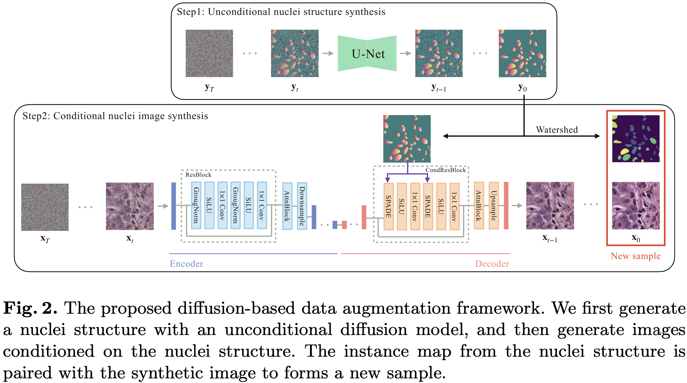

## 5.4 Experiment

### 5.4.1 Dataset

- **MoNuSeg [18]**: 包含 44 张有标注的图像, $1000\times 1000$.
- **Kumar [19]**: 包含 30 张有标注的图像, $1000\times 1000$.

### 5.4.2 实验

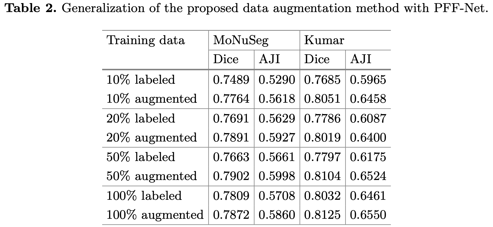

---

# 6. 使用 DM 中的 U-Net 的一层 embedding 用作分割和分类

[20] Héctor Carrión and Narges Norouzi. *FEDD - Fair, Efficient, and Diverse Diffusion-Based Lesion Segmentation and Malignancy Classification*. MICCAI, 2023.

## 6.1 Abstract

- 皮肤病影响着全世界所有种族的数百万人.
- 提高诊断的可获得性需要公正且准确地分割和分类皮肤病理学图像.
- 然而, 因为缺乏有标注的医学图像, 尤其是罕见病, 以及对肤色的代表性不足, 对开发一个具有公平性和准确性的模型提出了挑战.
- 在这项研究中, 我们提出一个**公平**, **高效**, **多样**的**基于扩散的 (diffusion-based)** 的框架 (**FEDD**), 用于皮肤病的分割和恶性的分类.
- FEDD 通过**去噪扩散概率骨架 (denoising diffusion probabilistic backbone)** 学习**语义上有意义的特征嵌入 (semantically meaningful feature embeddings)**, 并通过**线性探针 (linear probes)** 处理它们, 以实现在**多样化皮肤病学图像 (Diverse Dermatology Images, DDI)** 上达到 sota 性能.
- 我们分别在只使用 5%, 10%, 15% 和 20% 带标注的样本情况下, 达到了 0.18, 0.13, 0.06 和 0.07 的交并比 (IoU) 提升.
- 此外, 在 10% DDI 预训练的 FEDD 的恶性肿瘤分类准确率为 81%, 比 sota 高 14%.
- 我们在数据受限的情况下展示了高效性, 同时为不同肤色和罕见恶性病变条件提供公平的表现.

## 6.2 Motivation & Contribution

### 6.2.1 Motivation

- 皮肤疾病影响全球数百万人, 但诊断和治疗通常依赖于主观、耗时且成本高昂的视觉检查, 尤其是在资源匮乏的社区.
- 针对准确高效处理皮肤病变, 特别是在资源不足的地区, 迫切需要自动化方法.
- 皮肤病变分析的 AI 系统面临数据稀缺、类别不平衡、数据多样性不足、依赖非特定基础模型和对多样性种族及肤色研究不足等挑战.
- 现有 AI 模型常因这些问题而具有种族偏见和泛化能力差,这强调了需要更具包容性和平衡性的方法.

### 6.2.2 Contribution

- 引入了 FEDD 框架, 这是一种基于去噪扩散的方法, 用于皮肤病变分割和恶性分类, 在小型但肤色平衡的多样化皮肤病学图像子集上训练.
- FEDD 在众多肤色和恶性条件下的表现超越了当前方法, 且仅需最少的训练样本.
- 利用 DDPMs 学习的具有高度语义意义的特征嵌入进行图像合成, 并使用线性探针进行每像素类别或每图像恶性预测.
- 在 DDI 数据集上实现了最先进的性能, 无需对编码器进行微调, 解决了皮肤病学中现有 AI 模型的挑战.

## 6.3 Model

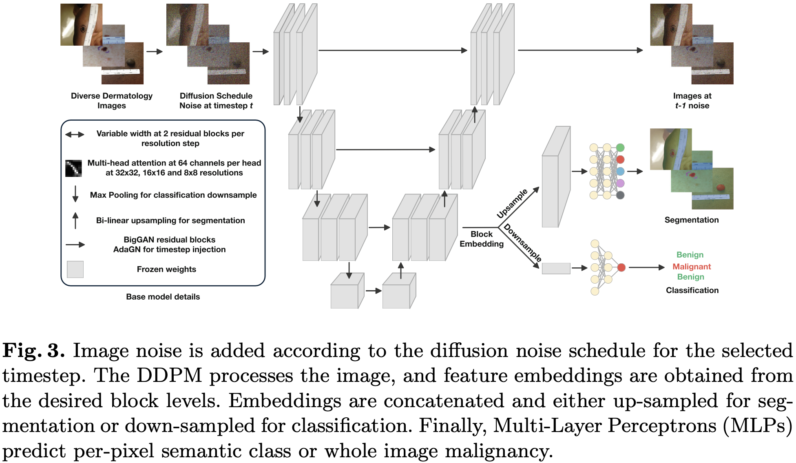

在 DM 中的 U-Net 中指定的一层获得 embedding, 它通过上采样以进行分割, 通过下采样以进行分类.

## 6.4 Experiment

### 6.4.1 Dataset

- **DDI [21]**.

### 6.4.2 横向对比

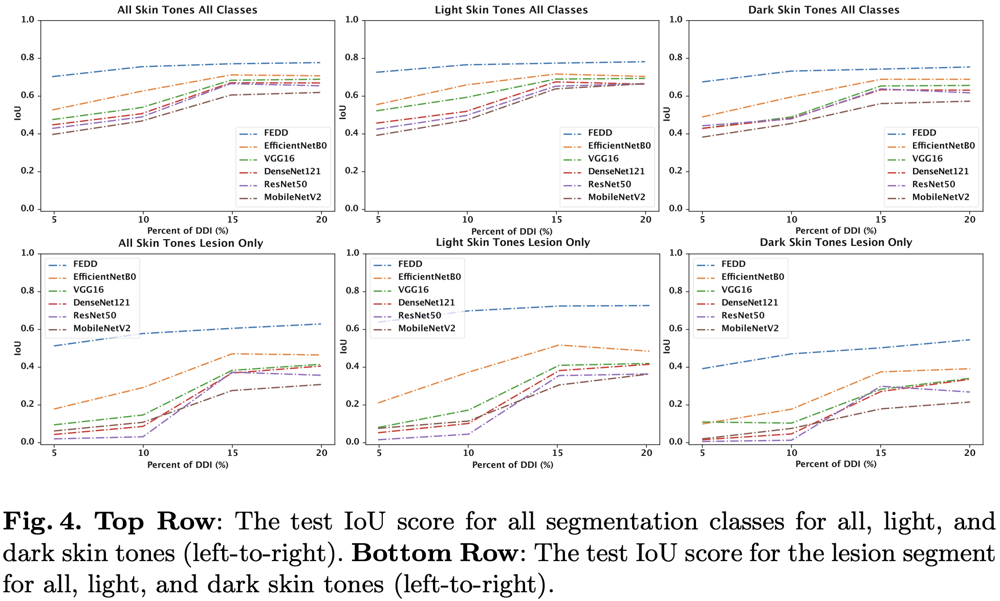

### 6.4.3 探索实验

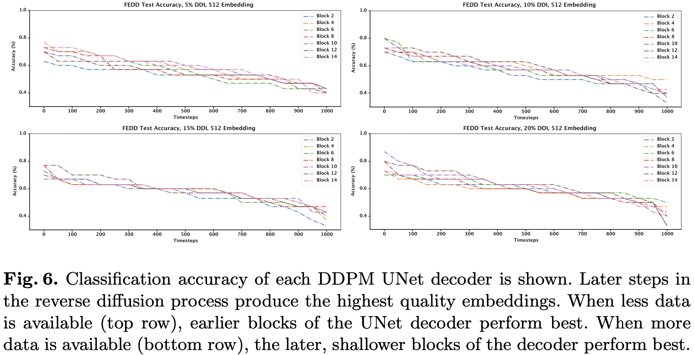

---

# 7. 使用 DM 生成 bounding box, 然后用于 mask 的生成

[22] Mengxue Sun, Wenhui Huang , and Yuanjie Zheng. *Instance-Aware Diffusion Model for Gland Segmentation in Colon Histology Images*. MICCAI, 2023.

## 7.1 Abstract

- 在病理图像分析中, 确定结肠组织学图像中腺体形态对于确定结肠癌的分级至关重要.
- 然而, 腺体的手动分割极其困难, 因此需要开发自动方法来分割腺体实例.
- 最近, 由于强大的噪声到图像去噪 pipeline, **扩散模型 (diffusion model)** 已成为计算机视觉研究的热点之一, 并已在图像分割领域得到探索.
- 在本文中, 我们提出了一种基于扩散模型的实例分割方法, 可以自动执行腺体实例的分割.
- 首先, 我们**将结肠组织学图像的实例分割过程建模为基于扩散模型的去噪过程**.
- 其次, 为了恢复在去噪过程中丢失的细节, 我们使用**实例感知滤波器 (Instance Aware Filters)** 和**多尺度掩码分支 (Multi-scale Mask Branch)** 来构建全局掩码, 而不仅仅是预测局部掩码.
- 然后, 为了提高物体与背景之间的区分度, 我们应用**条件编码 (Conditional Encoding)** 来增强中间特征与原始图像编码.
- 为了客观验证所提出的方法, 我们在 2015 年 MICCAI 腺体分割挑战(Gland Segmentation challenge, GlaS) 数据集和结直肠腺癌腺体 (Colorectal Adenocarcinoma Gland, CRAG) 数据集上, 将其与最先进的深度学习模型进行了比较.
- 实验结果表明, 我们的方法提高了分割的准确性, 并证明了该方法的有效性.

## 7.2 Motivation & Contribution

### 7.2.1 Motivation

- 结直肠癌通常表现为腺癌, 带有腺体结构, 这要求在组织学图像中对腺体实例进行准确分割, 以有效评估和判断恶性.
- 这些腺体实例的手动标注耗时且需要专业知识, 凸显了自动化分割方法的必要性.
- 现有深度学习分割方法在**准确捕捉多样的细胞形状**和**区分紧密排列的腺体边界**方面面临挑战.
- 扩散模型在图像合成和其他任务中显示出潜力, 暗示其在改进腺体实例分割方面的潜在适用性.

### 7.2.2 Contribution

- 提出了一种基于扩散模型的腺体实例分割新方法, 有效处理组织学图像中的去噪和分割问题.
- 使用**实例感知技术**和**多尺度掩码**分支恢复去噪过程中丢失的细节，并创建全局掩膜进行精细分割.
- 采用条件编码增强物体-背景区分, 将原始图像信息整合进来, 使分割更清晰.
- 在 GlaS 挑战和 CRAG 数据集上成功训练和测试了该方法, 证明了其在临床应用中的有效性和潜力.

## 7.3 Model

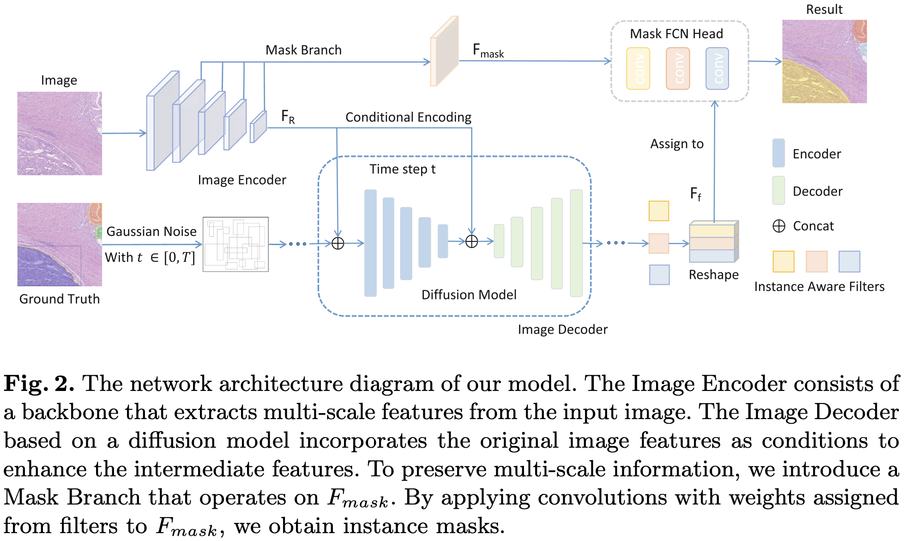

- Image 输入, 通过 ResNet 提取不同尺度的特征. 最后一层的特征为 $F_R$. 
- 使用 Mask Branch 将不同尺度的特征融合, 并最终输出一个 $F_{\text{mask}}$.
- Diffusion Model 用于生成带有 grounding boxes 的图, 以时间步 $t$ 和 image 的特征 $F_R$ 为条件.
- Instance Aware Filters 以 Diffusion Model 的输出和时间步 $t$ 作为输入, 输出 $F_f^t$.
- 最后, 使用 Mask FCN Head 接收 $F_{\text{mask}}$ 和 $F_f^t$, 输出分割掩码图 $s$.

## 7.4 Experiment

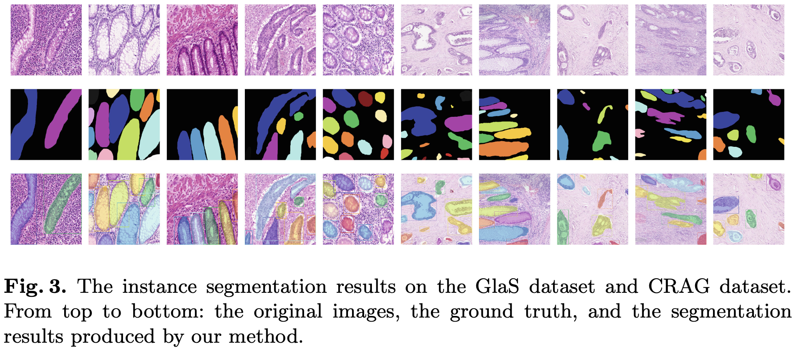

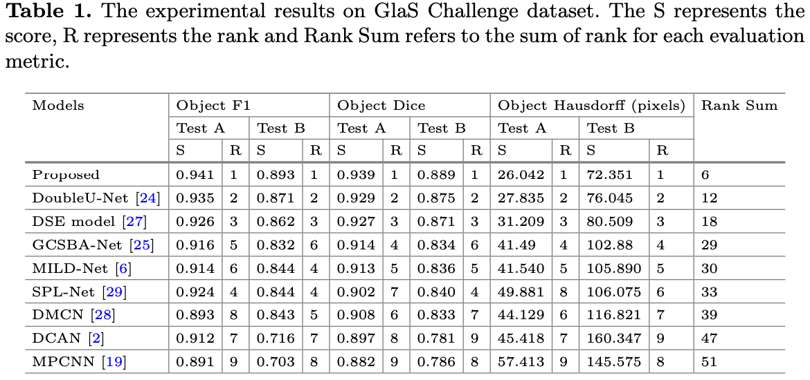

---

# 8. 使用 DM 做分割, 并用 DS 证据理论来促进多模态融合

[23] Jianfeng Zhao and Shuo Li. *Learning Reliability of Multi-modality Medical Images for Tumor Segmentation via Evidence-Identified Denoising Diffusion Probabilistic Models*. MICCAI, 2023.

## 8.1 Abstract

- 因为缺乏解析可靠的多模态医学图像能力, **去噪扩散概率模型 (Denoising Diffusion Probabilistic Models, DDPMs)** 用于医学图像分割仍然是一个具有挑战性的任务.
- 在本文中, 我们提出了一种新颖的**具有上下文感知能力的证据识别概率扩散模型 (Evidence-Identified DDPM, EI-DDPM)**, 通过整合多模态医学图像用于肿瘤分割.
- 与以往的工作相比, EI-DDPM 采用基于 DDPM 的框架来处理多模态医学图像下的分割任务, 并通过上下文感知证据理论来解析多模态医学图像的可靠性. 
- 我们在一个包含 1251 名受试者的 BraTS 2021 数据集和一个包含 238 名受试者的肝脏 MRI 数据集上应用 EI-DDPM.
- 广泛的实验证明了 EI-DDPM 的优越性, 其性能超过了当前最先进的方法.

## 8.2 Motivation & Contribution

### 8.2.1 Motivation

- 整合多模态医学图像进行肿瘤分割对于全面诊断和手术规划至关重要, 但由于医学图像的复杂性和可变性, 这一任务充满挑战.
- 现有的多模态医学图像整合方法缺乏评估不同模态信息可靠性的机制.
- <a href="https://yusijin02.github.io/notes-DS-evidence-theory/">Dempster-Shafer 理论 (DST)</a> 为整合不确定信息提供了框架, 但尚未有效应用于医学成像中权衡不同解剖信息.
- 利用去噪扩散概率模型 (DDPM) 解析多模态医学图像的可靠性, 可以显著提升肿瘤分割效果.

### 8.2.2 Contribution

- 提出了一种具有上下文感知的证据识别扩散概率模型 (EI-DDPM), 用于整合多模态医学图像进行肿瘤分割.
- 开发了一种结合 DDPM 与 DST 的新方法, 用于评估和权衡来自不同医学成像模态的信息可靠性.
- 使用 BraTS 2021 数据集进行脑肿瘤分割和肝脏 MRI 数据集进行肝肿瘤分割的广泛实验, 证明了 EI-DDPM 相比其他方法的优越性.

## 8.3 Model

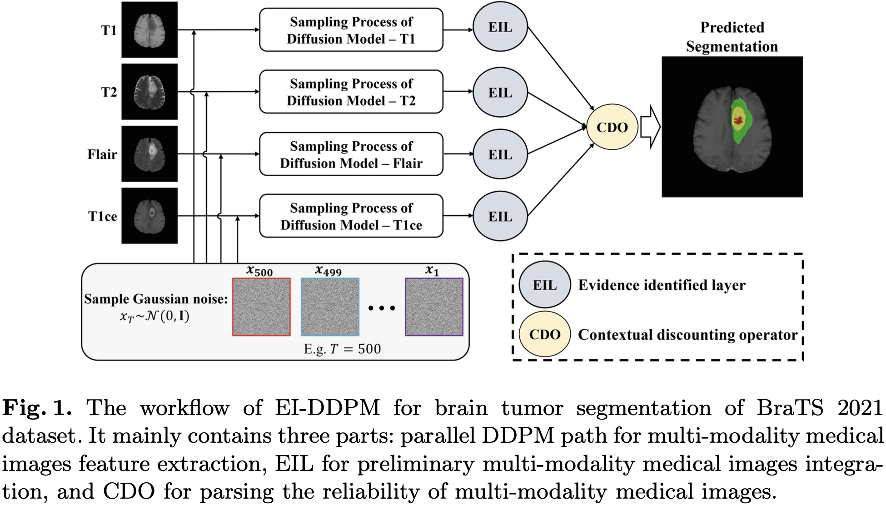

EI-DDPM 模型由三个部分组成：

- 并行的 DDPM 模型 (四路, 分别是四种不同的 MRI 模态: T1, T2, Flair, T1ce), 用于图像特征的提取.
- **EIL (Evidence Identified Layer)** 用于初步的多模态医学图像合成.
- **CDO (Contextual Discounting Operator)** 用于解析多模态医学图像可靠性.

### 8.3.1 Parallel DDPM Path

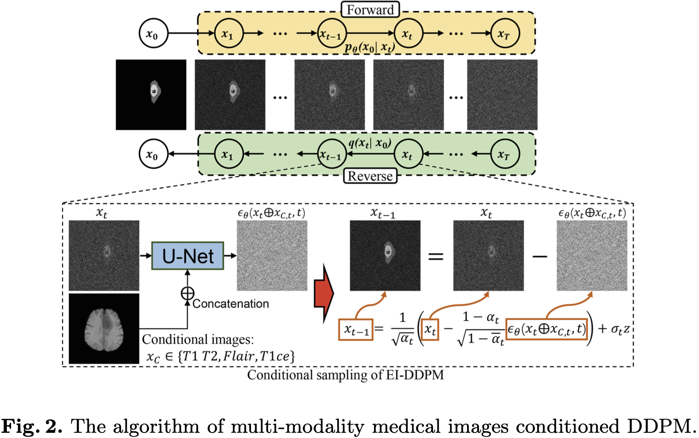

DDPM 用于生成分割图, 以某一模态的图像为条件.

### 8.3.2 EIL & CDO

使用下文中的方法:

https://blog.csdn.net/yusijinfs/article/details/134427358

将 T1, T2, Flair, T1ce 四种模态的分割结果做融合.

## 8.4 Experiment

### 8.4.1 Dataset

- **BraTS 2021 [24, 25, 26]**. 包括 1251 个被试的 T1, T2, Flair, T1ce 四个对齐的 MRI 模态. 标注包括三个区域: ET (使用钆作为对比剂后显示出增强信号的肿瘤部分), NCR (肿瘤内部的坏死区域), ED (肿瘤周围的水肿区域).
- **Liver MRI**.

### 8.4.2 对比实验

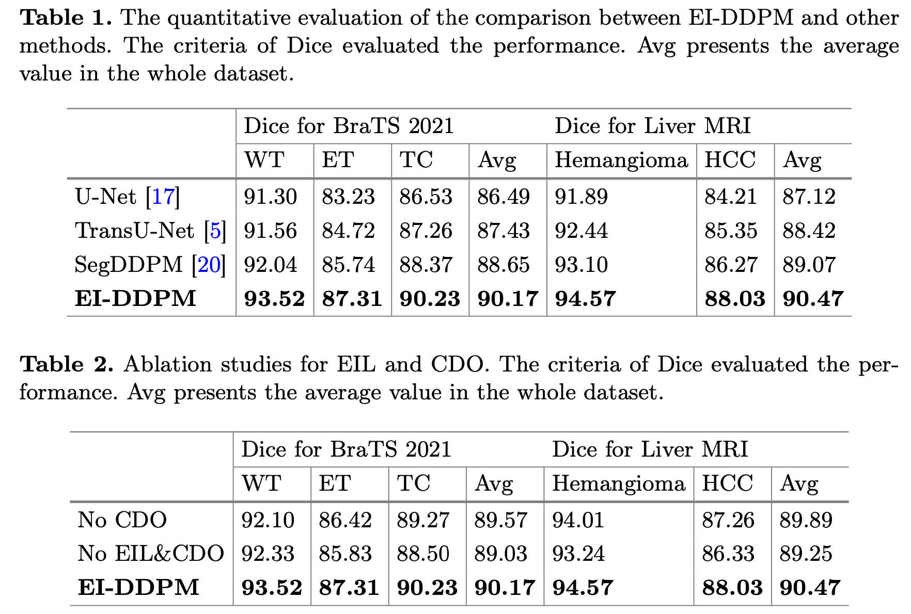

---

# 9. 在同一个 DM 分割模型中多次采样, 融合每次的结果, 并衡量不确定性

[27] Jiacheng Wang, Jing Yang, Qichao Zhou, Liansheng Wang. *Medical Boundary Diffusion Model for Skin Lesion Segmentation*. MICCAI, 2023.

## 9.1 Abstract

- 由于多尺度边界关注和特征增强模块的进步, 皮肤病变在皮肤镜图像中的分割近期取得了成功.
- 然而, 依赖于端到端学习范式的现有方法, 这些方法直接输入图像并输出分割图, 常常难以处理极其困难的边界, 例如在特别小或特别大的病变中发现的边界.
- 这一限制产生的原因是, 任何有限模型的感受野和局部上下文提取能力不可避免地受到限制, 而且为更大的模型获取额外的专家标注数据成本高昂.
- 受到将图像合成视为参数化链式过程的扩散模型令人印象深刻的进步的启发, 我们引入了一种新颖的方法, 将皮肤病变分割**构想为一个边界演化过程**, 以彻底探索边界.
- 具体来说, 我们提出了**医学边界扩散模型 (Medical Boundary Diffusion Model, MB-Diff)**, 该模型以随机采样的高斯噪声为起点, 通过有限次数的边界演化来获得清晰的分割图.
- 首先, 我们提出了一个高效的**多尺度图像引导模块 (Multi-Scale Image Guidance Module)** 来约束边界的演化, 使演化方向适应我们所需的病变.
- 其次, 我们提出了一种**基于演化不确定性的融合策略 (Evolution Uncertainty-Based Fusion Strategy)**, 用以细化演化结果并产生更精确的病变边界.
- 我们在两个流行的皮肤病变分割数据集上评估了我们模型的性能, 并将我们的模型与最新的 CNN 和 Transformer 模型进行了比较.
- 我们的结果表明, 我们的模型在所有指标上都优于现有方法, 并在极具挑战性的皮肤病变上取得了卓越的性能.
- 所提出的方法有潜力显著提高皮肤病变分割的准确性和可靠性, 为诊断和治疗提供关键信息.

## 9.2 Motivation & Contribution

### 9.2.1 Motivation

- 从皮肤镜图像中分割皮肤病变是皮肤癌诊断和治疗规划中的关键任务.
- 手动病变分割耗时且容易受到观察者间和观察者内变异性的影响.
- 为了提高临床工作流程的效率和准确性, 多年来开发了许多自动皮肤病变分割模型.
- 这些模型通过使用多尺度特征融合、注意力机制等技术来增强特征表示, 从而在皮肤病变分割性能上取得了显著改进.
- 然而, 对于边界模糊的皮肤病变分割, 特别是在极具挑战性的尺度上, 仍然是一个需要解决的瓶颈问题.

### 9.2.2 Contribution

- 为了解决这一挑战, 我们提出了一种新的方法, 将重点从仅仅分割病变边界转移到预测其演化.
- 我们的方法受到扩散概率模型在图像合成方面的最新进展的启发, 这些模型通过有限步骤从随机采样的高斯分布生成合成样本.
- 我们调整了这个过程, 以将皮肤病变边界的演化建模为一个参数化的链式过程, 从高斯噪声开始, 经过一系列去噪步骤, 最终产生一个具有明确病变边界的清晰分割图.
- 通过预测链式过程中的下一步而不是最终分割图, 我们的方法能够比以前的模型更准确地分割具有挑战性的病变.
- 我们在 ISIC-2016 和 PH2 数据集上评估了我们的模型, 并发现它比现有模型表现得更好.

## 9.3 Model

- DM 用于生成分割的边界 mask 图, 以原图为条件.

### 9.3.1 Evolution Uncertainty

- DM 的模型参数被固定.

- 不同的分割结果是因为不用的高斯噪音初始化样本造成的.

- 令 $y_0$ 表示分割图 groundtruth.

- DM 的初始噪音为 $y_T^*\sim\mathcal N(0, \mathbf I)$.

- 假设对一个图像进行 $n$ 次分割, 则第 $i$ 次的初始噪音为 $y_T^{*,i}$.

- 对 $n$ 个初始化噪音 $\{y_T^{*,i}\}_{i=1}^n$, 都跑 DM, 则均值 $\{\mu^{*, i}\}_{i=1}^n$ 和方差 $\{\Sigma^{*,i}\}_{i=1}^n$ 为 DM 得到的结果.

- 第 $i$ 个分割图计算如此计算: $y^{*,i}=\mu^{*,i}+\exp(\frac12\Sigma^{*,i})\mathcal N(0, \mathbf I)$.

- 不确定性如此计算:
  $$
  \delta=\sqrt{\frac{1}{n}\sum^n_{i=1}\left(\mu^{*,i}-\frac{1}{n}\sum_{j=1}^{n}\mu^{*,j}\right)^2}
  $$

- 分割图由最大值投票得来: $y^*=(\sum_{i=1}^ny^{*,i})\geq \tau$. 其中, $\tau$ 是投票阈值.

## 9.4 Experiment

### 9.4.1 Dataset

- **ISIC-2016 [28]**.
- **PH2 [29]**.

### 9.4.2 消融实验和对比实验

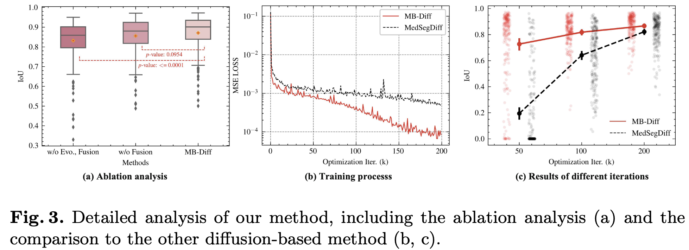

---

# 10. 开山鼻祖 MedSegDiff: 使用动态条件编码和可学习滤波器的 DM 医学图像分割

[30] Junde Wu, Rao Fu, Huihui Fang, Yu Zhang, Yehui Yang, Haoyi Xiong, Huiying Liu, and Yanwu Xu. *MedSegDiff: Medical Image Segmentation with Diffusion Probabilistic Model*. MIDL, 2023.

## 10.1 Abstract

- **扩散概率模型 (Diffusion Probabilist Model, DPM)** 最近成为了计算机视觉里最热门的话题之一.
- 它的图像生成应用, 包括图像层面、隐藏层面的扩散模型和稳定扩散, 已展现出令人印象深刻的生成能力, 在社区中引起了广泛讨论.
- 许多近期研究还发现它在许多其他视觉任务中也很有用, 例如图像去模糊、超分辨率和异常检测.
- 受 DPM 成功的启发, 我们提出了**第一个**基于 DPM 的模型, 用于通用医学图像分割任务, 我们将其命名为 **MedSegDiff**.
- 为了增强 DPM 中用于医学图像分割的**逐步区域注意力 (Step-wise Regional Attention)**, 我们提出了**动态条件编码 (Dynamic Conditional Encoding)**, 为每个采样步骤建立了状态自适应条件.
- 我们进一步提出了**特征频率解析器 (Feature Frequency Parser, FF-Parser)**, 以消除此过程中高频噪声成分的负面影响. 
- 我们在三个具有不同图像模态的医学分割任务上验证了MedSegDiff, 这些任务分别是视网膜图像上的视杯分割、MRI图像上的脑肿瘤分割以及超声图像上的甲状腺结节分割.
- 实验结果表明, MedSegDiff 在性能上显著超过 sota 方法, 表明所提出模型的泛化能力和有效性.

## 10.2 Motivation & Contribution

### 10.2.1 Motivation

- 分割是许多医学图像分析应用 (如诊断、手术规划和影像引导手术) 中的基本步骤.
- 它的重要性在于, 它能帮助医生和其他医疗专业人员更好地理解他们所看到的内容, 它还使比较图像和随时间跟踪变化变得更容易.

### 10.2.2 Contribution

- 受 DPM 近期成功的启发, 我们设计了一种独特的基于 DPM 的分割模型, 用于医学图像分割任务.
- 我们提出了首个适用于不同图像模态的通用医学图像分割的基于 DPM 的模型.
- 我们提出了动态条件编码策略, 用于逐步关注.
- 我们提出了 FF-Parser 来消除高频分量的负面影响.
- 在三个不同图像模态的医学分割任务上均超越了以前的最先进水平.

## 10.3 Model

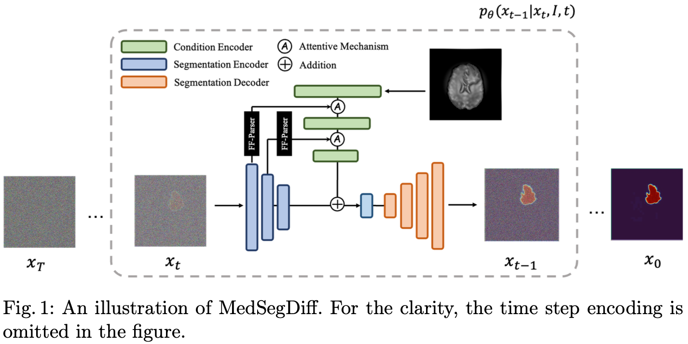

- 扩散模型用于分割的生成.

- 原始图像用于扩散的条件.

- Attention 机制的描述如下:
  $$
  \mathcal A(m_I^k, m_x^k)=(LN(m_I^k)\otimes LN(m_x^k))\otimes m_I^k
  $$

  - $\otimes$ 是按元素相乘.
  - $LN$ 是 layer normalization.
  - $m_I^k$ 和 $m_x^k$ 分别表示第 $k$ 层的图像特征和分割特征.

### 10.3.1 FF-Parser

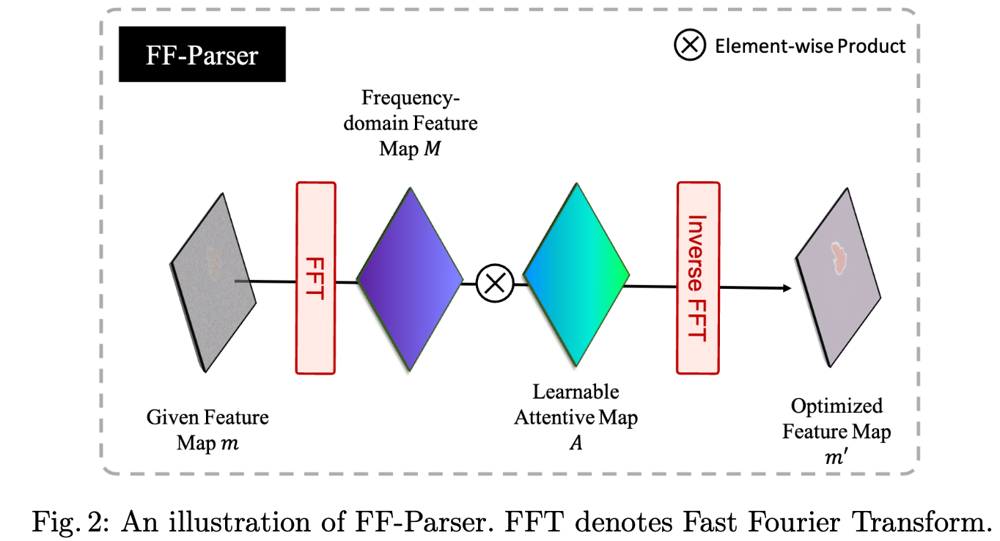

- 给定特征图为 $m\in \mathbb R^{H\times W\times C}$.

- 计算其 2D **快速傅立叶变换 (Fast Fourier Transform, FFT)**:
  $$
  M=\mathcal F[m]\in\mathbb C^{H\times W\times C}
  $$

- 学习一个频域**注意图 (Attentive Map)**:

$$
M'=A\otimes M
$$

- 对新的频域图做**逆快速傅立叶变换 (IFFT)**:

$$
m'=\mathcal F^{-1}[M']
$$

- $m'$ 即为滤波器的输出.

## 10.4 Experiment

### 10.4.1 Dataset

- **REFUGE-2 [31]**.
- **BraTS-2021 [4]**.
- **DDTI [32]**.

### 10.4.2 对比实验

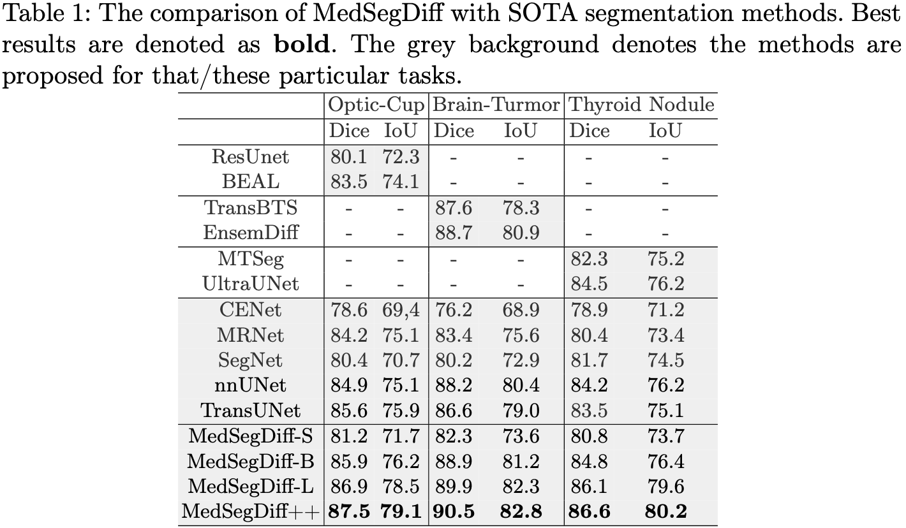

### 10.4.3 消融实验

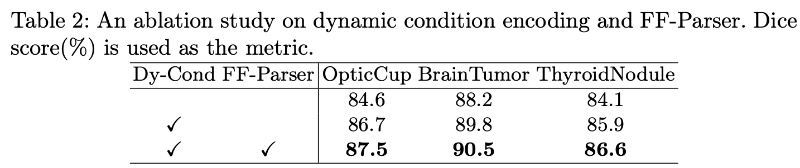

---

# 11. MedSegDiff-V2: 同时在空间域和频率域上做 Attn 的条件和嵌入融合, 使用 DM 直接生成分割

[33] Junde Wu, Rao Fu, Huihui Fang, Yu Zhang, and Yanwu Xu. *MedSegDiff-V2: Diffusion based Medical Image Segmentation with Transformer*. arXiv preprint arXiv:2301.11798, 2023.

## 11.1 Abstract

- **扩散概率模型 (Diffusion Probabilistic Model, DPM)** 最近在计算机视觉领域获得了广泛的关注, 这要归功于它在图像生成应用方面的成功, 例如图像层面和隐藏层面扩散模型, 与稳定扩散等, 这些应用展示了令人印象深刻的能力, 并在社区内引发了大量讨论.
- 近期研究还发现 DPM 在医学图像分析领域也很有用, 医学图像分割模型 MedSegDiff 在各种任务中的强大表现便是明证.
- 虽然这些模型最初是以 UNet 骨干网络设计的, 但它们也可能从集成ViT 技术中获益.
- 然而, 我们发现仅仅将这两种方法结合起来会导致性能不佳.
- 在本文中, 我们提出了一种新颖的基于变换器的条件 UNet 框架, 以及一个新的**频谱空间 Transformer (Spectrum-Space Transformer, SS-Former)**, 用于建模噪声与语义特征之间的交互.
- 这种架构上的改进导致了一种新的基于扩散的医学图像分割方法, 称为 **MedSegDiff-V2**, 它显著提高了 MedSegDiff 的性能.
- 我们已经在五个具有不同图像模态的分割数据集中的十八个器官上验证了 MedSegDiff-V2 的有效性.
- 我们的实验结果表明, MedSegDiff-V2 在相当大的范围内超越了SOTA 方法, 进一步证明了所提出模型的泛化能力和有效性.

## 11.2 Motivation & Contribution

### 11.2.1 Motivation

- 医学图像分割对诊断和手术规划至关重要, 需要改进一致性和准确性,自动化方法可以提供这些改进.
- 深度学习已经推动了医学图像分割的进步, 但将新型模型如扩散概率模型 (DPM) 与现有方法整合仍然充满挑战.

- 存在一种需求, 即需要弥合基于 Transformer 的模型与 DPM 在有效医学图像分割中的差距.

### 11.2.2 Contribution

- 首次将变换器架构与基于扩散的模型整合应用于通用医学图像分割, 这在该领域是一种新颖的方法.
- 开发了一种使用高斯空间注意力的锚点条件来减少扩散方差, 提升模型性能.
- 实现了一种带有**频谱-空间变换器 (SS-Former)** 的语义条件, 有效处理分割噪声与语义特征之间的相互作用.

## 11.3 Model

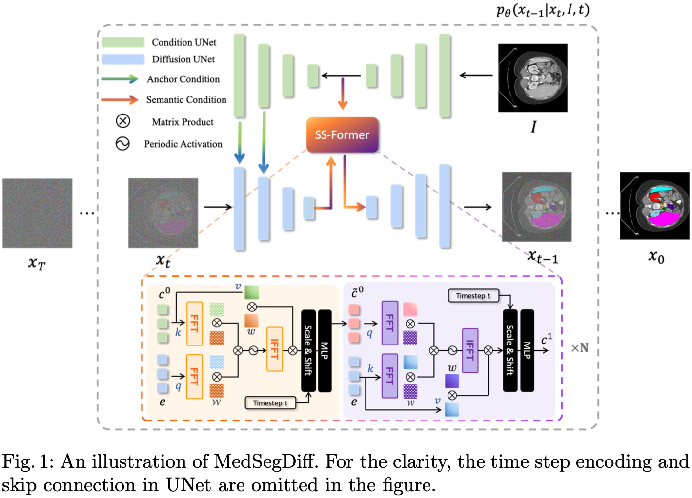

- 扩散模型用于生成分割, 图像作为条件.

## 11.4 Experiment

### 11.4.1 Dataset

- **AMOS 2022 [34]**. 腹部多器官分割 CT 扫描.
- **REFUGE-2 [31]**. 视网膜视杯分割.
- **BraTS [4]**. MRI 脑肿瘤分割.
- **DDTI [32]**. 超声成像甲状腺结节分割.

### 11.4.2 消融实验

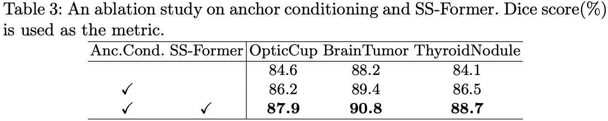

### 11.4.3 对比实验

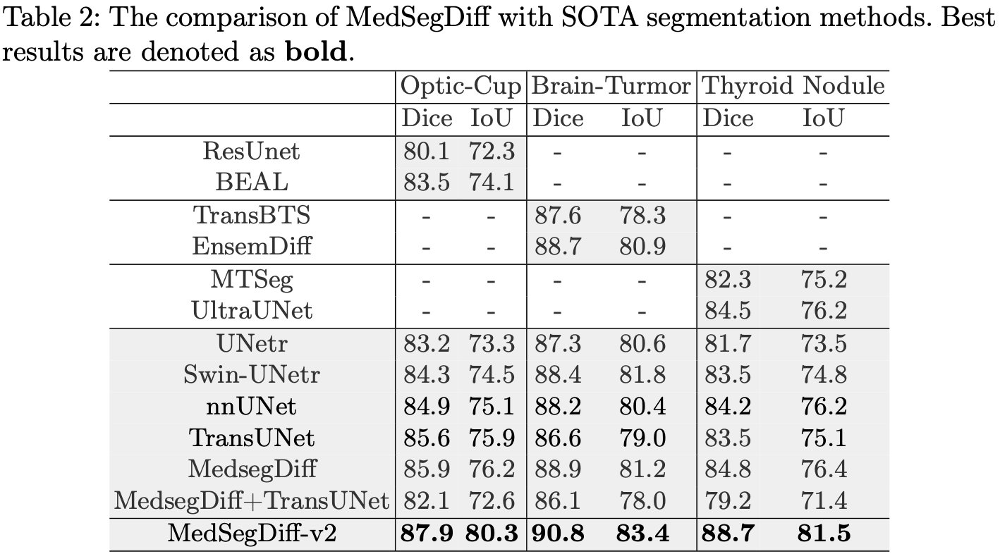

---

# 12. 使用对抗学习的自监督分割 (含有 DM)

[35] Boah Kim, Yujin Oh, Jong Chul Ye. *Diffusion Adversarial Representation Learning for Self-supervised Vessel Segmentation*. ICLR, 2023.

## 12.1 Abstract

- 在医学图像中的血管分割是血管疾病诊断和治疗规划中的重要任务之一.
- 虽然基于学习的分割方法已经被广泛研究, 但在监督方法中需要大量真实标签, 而且混乱的背景结构使得神经网络在非监督方式下难以分割血管.
- 为了解决这个问题, 我们在这里引入了一种新颖的**扩散对抗表示学习(Diffusion Adversarial Representation Learning, DARL) 模型**, 该模型结合了去噪扩散概率模型和对抗学习, 并将其应用于血管分割.
- 特别是对于自监督的血管分割, DARL 通过一个扩散模块学习背景信号, 这使得生成模块能够有效地提供血管表示.
- 此外, 通过基于所提出的**可切换空间自适应去归一化 (Switchable Spatial- Adaptive Denormalization)** 的对抗学习, 我们的**模型估计合成的假血管图像以及血管分割掩码**, 这进一步使模型捕获与血管相关的语义信息.
- 一旦所提出的模型被训练, 它可以在**单个步骤**中生成分割掩码, 并且可以应用于冠状动脉造影和视网膜图像的一般血管结构分割.

- 在各种数据集上的实验结果表明, 我们的方法显著优于现有的非监督和自监督血管分割方法.

## 12.2 Motivation & Contribution

### 12.2.1 Motivation

- 临床诊断中的血管分割面临挑战, 如 X 光血管造影中的低对比度和复杂结构, 这需要更先进的方法来准确分析和治疗规划.
- 传统和基于学习的分割方法存在局限性, 如需要大量标记数据或难以将非监督方法应用于医学图像.
- 扩散模型在多样化图像生成和数据分布建模方面显示出潜力, 但尚未有效地应用于无标签数据的语义分割.

### 12.2.2 Contribution

- 开发了一种新型的扩散对抗性表征学习 (DARL)模型, 用于自监督的血管分割, 这是一种无需真实标签的非迭代方法.
- 该模型结合了扩散模块和生成模块进行对抗性学习, 有效地分割血管并生成合成血管造影图像.
- 在包括视网膜图像在内的多个数据集上展示了卓越的血管分割性能, 确认了模型的有效性和泛化能力.

## 12.3 Model

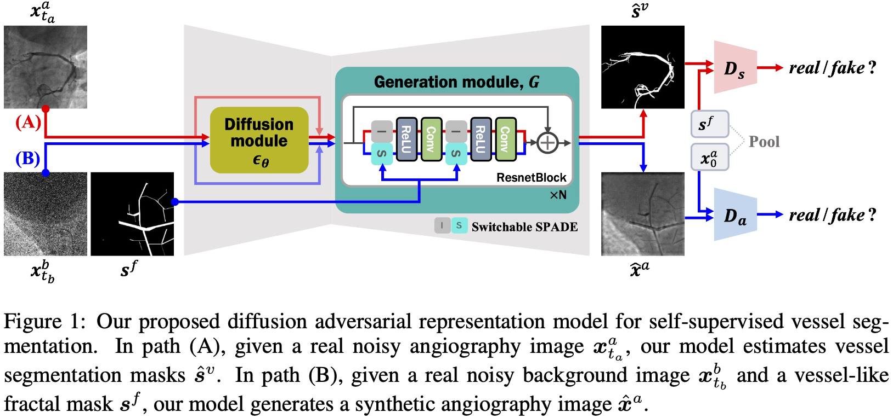

一组数据由两个图像组成, $x_0^a$ 为**血管造影 (angiography)**, $x_0^b$ 为**背景 (background)**. 在数据采集时, 先采集 $x_0^b$, 然后给患者注射对比剂, 然后采集到 $x_0^a$, 在这个过程中可能**由于患者的移动导致两张图不对齐**.

- **扩散模块 (Diffusion Module)** $\epsilon_\theta$ 用于估计**潜在特征 (latent features)**.
- **生成模块 (Generation Module)** $G$ 用于估计血管分割 mask $\hat s^v$ 和生成的血管造影 $\hat x^a$.
- **鉴别器 (Discriminator)** $D_s$ 和 $D_a$ 用于鉴别分割是否为真的, 血管造影是否为真的.

### 12.3.1 Generation Module

生成模块由 $N$ 个 ResnetBlock 组成. 每个 ResnetBlock 的计算是可切换的 (计算取决于当前是路径 A 还是 B). 令特征图为 $v\in\mathbb R^{B\times C\times H\times W}$, $B, C, H, W$ 分别为批量大小, 通道数, 高, 宽. 在可切换层的计算如下:

- 当计算路径 A 时, 即不输入 mask 图 $s$:
  $$
  v=\text{IN}(v)
  $$
  其中 $\text{IN}(\cdot)$ 是 instance normalization.

- 当计算路径 B 时, 即输入 mask 图 $s$:
  $$
  v=\text{SPADE}(v, s)
  $$
  其中, $\text{SPADE}(\cdot,\cdot)$ 的定义为:
  $$
  v_{b,c,h,w}=\gamma_{c, h, w}(s^f)\frac{v_{b,c,h,w}-\mu_c}{\sigma_c}+\beta_{c, h, w}(s^f)
  $$

  - $v_{b, c, h, w}$ 表示张量 $v$ 的下标为 $(b, c, h, w)$ 的元素.
  - $\mu_c, \sigma_c$ 表示张量 $v$ 在通道 $c$ 上所有元素的均值和方差.
  - $\gamma_{c, h, w}$ 和 $\beta_{c, h, w}$ 为可学习的参数.

最后, 模型的生成方式为:

- 路径 A: 给定加噪的血管造影 $x^a_{t_a}$, 使用扩散模块计算 latent space $\epsilon_\theta (x_{t_a}^a, t_a)$, 生成模块 $G$ 生成分割 mask $\hat s^v$:
  $$
  \hat s^v=G(\epsilon_\theta(x_{t_a}^a,t_a);0)
  $$

- 路径 B: 给定加噪的背景 $x_{t_b}^b$, 使用扩散模块计算 latent space $\epsilon_\theta(x_{t_b}^b,t_b)$, 加上分割前景 $s^f$, 生成模块 $G$ 生成血管造影 $\hat x^a$:
  $$
  \hat x^a=G(\epsilon_\theta(x_{t_b}^b, t_b);s^f)
  $$

### 12.3.2 Loss Function

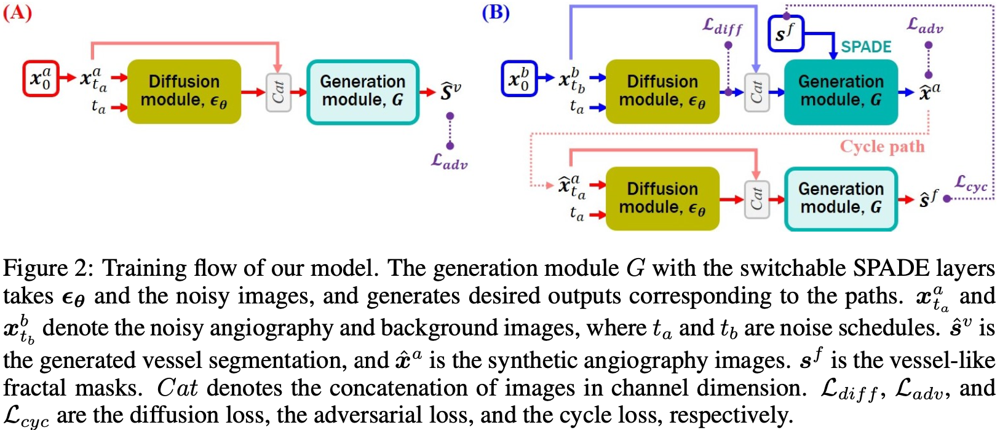

对于训练的描述如上图所示, 用到了三个损失函数 $\mathcal L_{adv}, \mathcal L_{diff}, \mathcal L_{cyc}$.

- **Adversarial loss 对抗损失** $\mathcal L_{adv}$

  这一损失的目的是同时训练生成器和鉴别器.

  用于生成器的训练:
  $$
  \mathcal L_{adv}^G(\epsilon_\theta, G, D_s, D_a)=\mathbb E_{x^a}[(D_s(G(\epsilon_\theta(x^a); 0))-1)^2] + \mathbb E_{x^a, s^f}[(D_s(G(\epsilon_\theta(x^a); s^f))-1)^2]
  $$
  用于鉴别器的训练:
  $$
  \mathcal L_{adv}^{D_s}(\epsilon_\theta, G, D_s)=\frac12\mathbb E_{s^f}[(D_s(s^f)-1)^2]+\frac12\mathbb E_{x^a}[(D_s(G(\epsilon_\theta(x^a);0))^2]
  $$

  $$
  \mathcal L_{adv}^{D_a}(\epsilon_\theta, G, D_a)=\frac12\mathbb E_{x^a_0}[(D_a(x_0^a)-1)^2]+\frac12\mathbb E_{x^b,s^f}[(D_a(G(\epsilon_\theta(x^b);s^f))^2]
  $$

- **Diffusion loss 扩散损失** $\mathcal L_{diff}$

  这一损失的目的是训练扩散模型
  $$
  \mathcal L_{diff}(\epsilon_\theta)=\mathbb E_{t, x_0, \epsilon}[||\epsilon-\epsilon_\theta(\sqrt{\alpha_t}x_0+\sqrt{1-\alpha_t}\epsilon, t)||^2]
  $$

- **Cyclic reconstruction loss 循环重建损失** $\mathcal L_{cic}$

  这是保证使用 $s^f$ 生成的 $\hat x^a$ 再拿去生成 $\hat s^f$, 两者重建应当一致.
  $$
  \mathcal L_{cyc}(\epsilon_\theta, G)=\mathbb E_{x_b, s^f}[||G(\epsilon_\theta(G(\epsilon_\theta(x^b);s^f));0)-s^f||]
  $$

最后, 总的损失有两个:

- 总扩散/生成损失:
  $$
  \mathcal L^G(\epsilon_\theta, G, D_s, D_a)=\mathcal L_{diff}(\epsilon_\theta)+\alpha \mathcal L_{adv}^G(\epsilon_\theta, G, D_s, D_a)+\beta \mathcal L_{cyc}(\epsilon_\theta, G)
  $$

- 总鉴别损失:
  $$
  \mathcal L^D(\epsilon_\theta, G, D_s, D_a)=\mathcal L_{adv}^{D_a}(\epsilon_\theta, G, D_a)+\mathcal L_{adv}^{D_s}(\epsilon_\theta, G, D_s)
  $$

## 12.4 Experiment

### 12.4.1 Dataset

- **XCAD**: X 光冠状动脉造影疾病.
- **134 XCA**: X 光冠状动脉造影疾病.
- **30 XCA**: X 光冠状动脉造影疾病.
- **DRIVE**: 视网膜成像.
- **STARE**: 视网膜成像.

### 12.4.2 对比实验

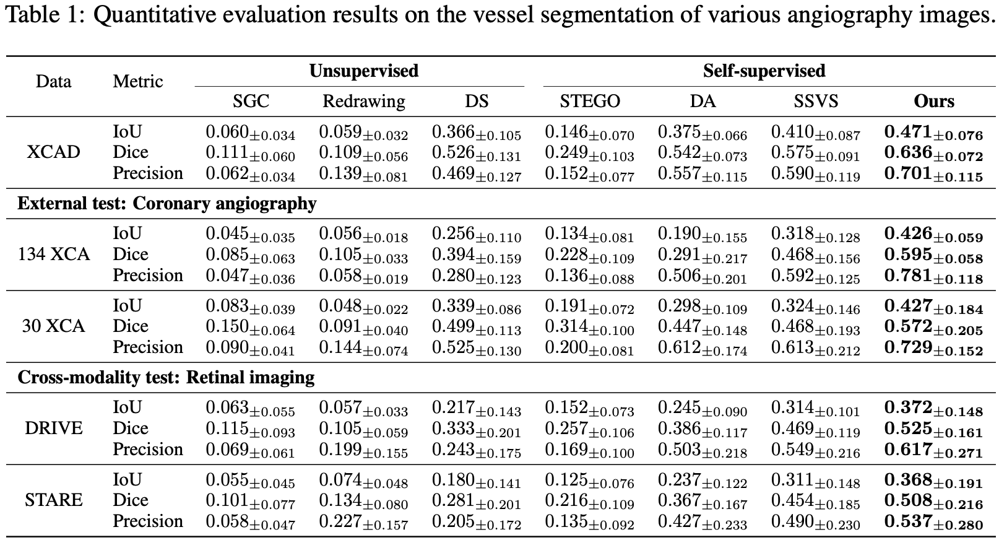

### 12.4.3 消融实验

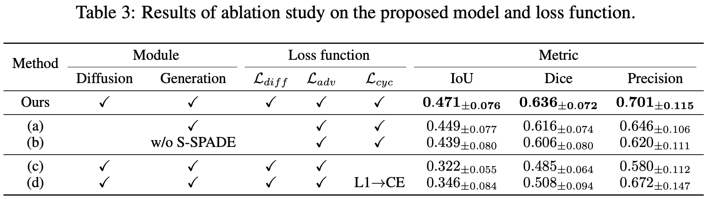

---

# 13. 自然图像上的 DM 分割

[36] Jiarui Xu, Sifei Liu, Arash Vahdat, Wonmin Byeon, Xiaolong Wang, Shalini De Mello.*Open-Vocabulary Panoptic Segmentation with Text-to-Image Diffusion Models*. CVPR, 2023.

## 13.1 Abstract

- 我们提出了**ODISE: 开放词汇扩散式全景分割 (Open-vocabulary DIffusion-based panoptic SEgmentation)**, 它将预训练的文本-图像扩散模型和判别模型统一起来, 以执行开放词汇的全景分割.
- **文本到图像的扩散模型 (Text-to-Image Diffusion Model)** 具有生成高质量图像的显著能力, 这些图像与多样的开放词汇语言描述相对应.
- 这表明它们的内部表示空间与现实世界中的开放概念高度相关.
- 另一方面, 像 CLIP 这样的文本-图像判别模型擅长将图像分类到开放词汇的标签中.
- 我们利用这两种模型的固定内部表示来执行任何野外类别的全景分割.
- 我们的方法在开放词汇全景和语义分割任务上均显著优于之前的最先进技术.
- 特别是, 仅通过 COCO 数据集训练, 我们的方法在 ADE20K 数据集上达到了 23.4 的 PQ 和 30.0 的 mIoU, 比之前的最先进技术分别提高了 8.3 PQ 和 7.9 mIoU.

## 13.2 Motivation & Contribution

### 13.2.1 Motivation

- 在计算机视觉中, 开放词汇识别对于模仿人类般的理解至关重要, 但缺乏一个统一的框架, 同时解析对象实例和场景语义.
- 现有的文本-图像判别模型虽然能够分类个别对象, 但在空间和关系理解上存在困难, 限制了其在全景分割中的有效性.
- 扩散模型在图像合成中显示出高度的语义控制潜力, 暗示它们可以被用于更全面的场景理解.

### 13.2.2 Contribution

- 提出了 ODISE, 这是一个结合了大规模文本-图像扩散和判别模型的新颖模型, 实现了任何类别的最先进全景分割.
- 开发了一个有效利用预训练的文本-图像扩散模型内部特征的pipeline, 用于开放词汇的全景分割.
- 在多种开放词汇识别任务上展示了超越现有基准的卓越性能, 为该领域树立了新标准.

## 13.3 Model

训练:

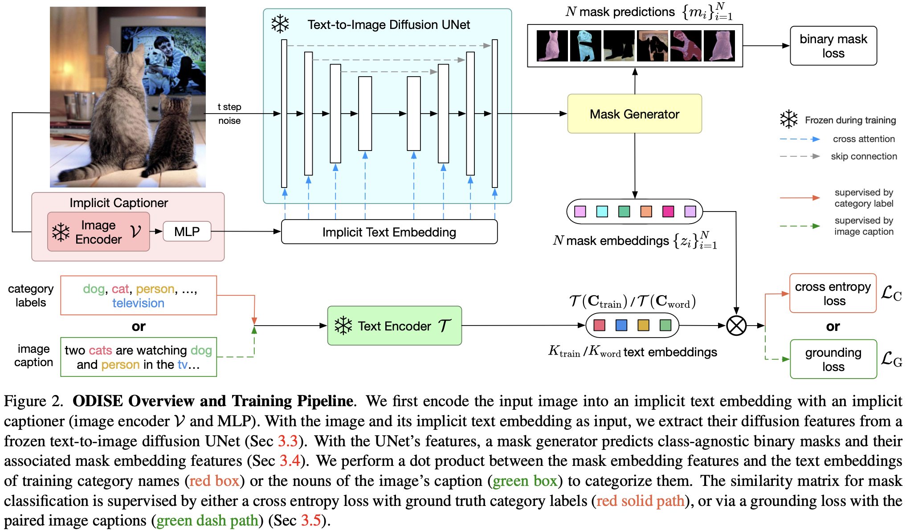

测试:

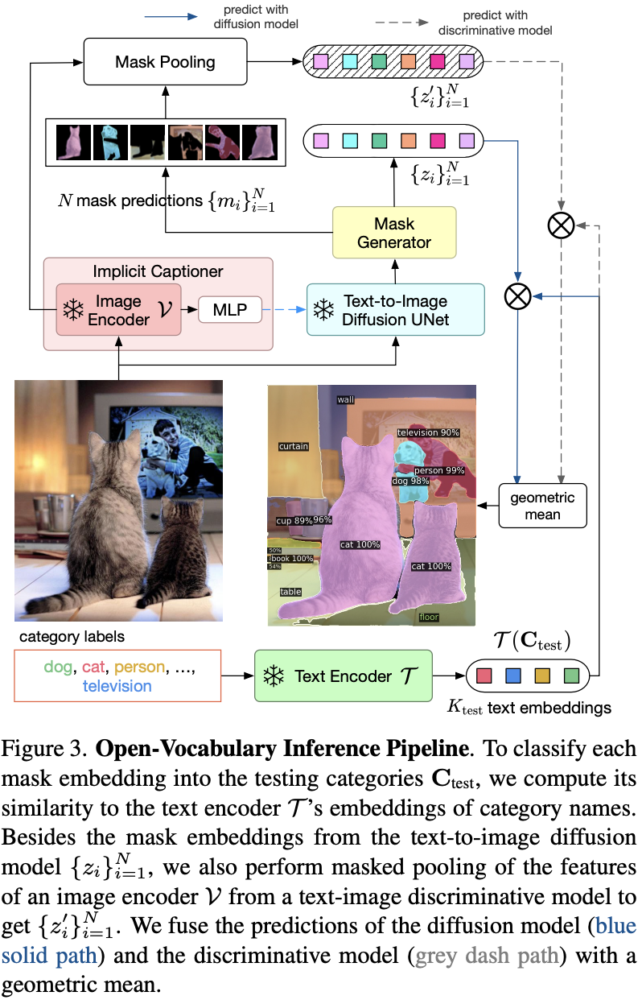

## 13.4 Experiment

### 13.4.1 Dataset

- **COCO**.

### 13.4.2 消融实验

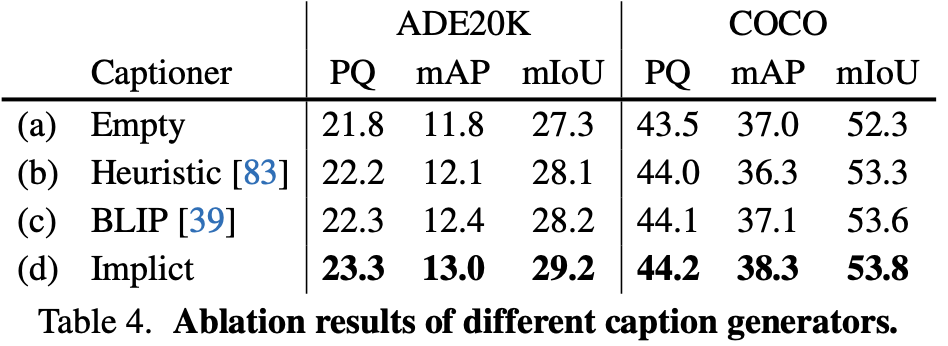

### 13.4.3 对比实验

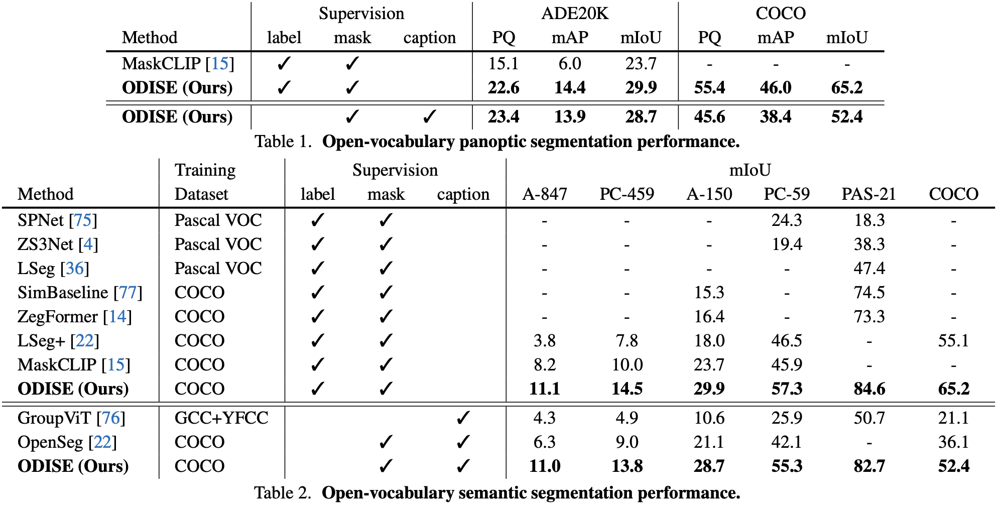

---

# Reference List

[1] Tao Chen, Chenhui Wang, Hongming Shan. *BerDiff: Conditional Bernoulli Diffusion Model for Medical Image Segmentation*. MICCAI, 2023.

[2] Armato III, S.G., McLennan, G., Bidaut, L., McNitt-Gray, M.F., Meyer, C.R., Reeves, A.P., Zhao, B., Aberle, D.R., Henschke, C.I., Hoffman, E.A., et al. *The lung image database consortium (LIDC) and image database resource initiative (IDRI): a completed reference database of lung nodules on CT scans*. Medical physics, 2011.

[3] Clark, K., Vendt, B., Smith, K., Freymann, J., Kirby, J., Koppel, P., Moore, S., Phillips, S., Maffitt, D., Pringle, M., et al. *The cancer imaging archive (TCIA): maintaining and operating a public information repository*. Journal of digital imaging, 2013.

[4] Baid, U., Ghodasara, S., Mohan, S., Bilello, M., Calabrese, E., Colak, E., Fara- hani, K., Kalpathy-Cramer, J., Kitamura, F.C., Pati, S., et al. *The RSNA-ASNR- MICCAI BraTS 2021 benchmark on brain tumor segmentation and radiogenomic classification*. arXiv:2107.02314, 2021.

[5] Xinrong Hu, Yu-Jen Chen, Tsung-Yi Ho, Yiyu Shi. *Conditional Diffusion Models for Weakly Supervised Medical Image Segmentation*. MICCAI, 2023.

[6] Bakas, S., Akbari, H., Sotiras, A., Bilello, M., Rozycki, M., Kirby, J.S., Freymann, J.B., Farahani, K., Davatzikos, C. *Advancing the cancer genome atlas glioma mri collections with expert segmentation labels and radiomic features*. Scientific data, 2017.

[7] Kavur, A.E., Gezer, N.S., Barı ̧s, M., Aslan, S., Conze, P.H., Groza, V., Pham, D.D., Chatterjee, S., Ernst, P., O ̈zkan, S., Baydar, B., Lachinov, D., Han, S., Pauli, J., Isensee, F., Perkonigg, M., Sathish, R., Rajan, R., Sheet, D., Dovletov, G., Speck, O., Nu ̈rnberger, A., Maier-Hein, K.H., Bozdag ̆ı Akar, G., U ̈nal, G., Dicle, O., Selver, M.A. *CHAOS Challenge - combined (CT-MR) healthy abdominal organ segmentation*. Medical Image Analysis, 2021.

[8] Tianxu Lv, Yuan Liu, Kai Miao, Lihua Li, Xiang Pan. *Diffusion Kinetic Model for Breast Cancer Segmentation in Incomplete DCE-MRI*. MICCAI, 2023.

[9] Newitt, D., Hylton, N. *Single site breast DCE-MRI data and segmentations from patients undergoing neoadjuvant chemotherapy*. Cancer Imaging Arch, 2016.

[10] Hyun-Jic Oh, Won-Ki Jeong. *DiffMix: Diffusion Model-Based Data Synthesis for Nuclei Segmentation and Classification in Imbalanced Pathology Image Datasets*. MICCAI, 2023.

[11] G. Jignesh Chowdary, Zhaozheng Yin. *Diffusion Transformer U-Net for Medical Image Segmentation*. MICCAI, 2023.

[12] Jha, D., et al. *Kvasir-SEG: a segmented polyp dataset*. Springer, Cham, 2020.

[13] Bernal, J., S ́anchez, F.J., Fern ́andez-Esparrach, G., Gil, D., Rodr ́ıguez, C., Vilarin ̃o, F. *Wm-dova maps for accurate polyp highlighting in colonoscopy: valida- tion vs. saliency maps from physicians*. Comput. Med. Imaging Graph, 2015.

[14] Codella, N.C., et al. *Skin lesion analysis toward melanoma detection: a challenge at the 2017 international symposium on biomedical imaging (ISBI), hosted by the international skin imaging collaboration (isic)*. ISBI, 2018.

[15] Tschandl, P., Rosendahl, C., Kittler, H. *The ham10000 dataset, a large collection of multi-source dermatoscopic images of common pigmented skin lesions*. Scientific data, 2018.

[16] Orlando, J.I., et al. *Refuge challenge: a unified framework for evaluating automated methods for glaucoma assessment from fundus photographs*. Med. Image Anal, 2020.

[17] Xinyi Yu, Guanbin Li, Wei Lou, Siqi Liu, Xiang Wan, Yan Chen, and Haofeng Li. *Diffusion-Based Data Augmentation for Nuclei Image Segmentation*. MICCAI, 2023.

[18] Kumar, N., et al. *A multi-organ nucleus segmentation challenge*. IEEE Trans. Med. Imaging, 2019.

[19] Kumar, N., Verma, R., Sharma, S., Bhargava, S., Vahadane, A., Sethi, A. *A dataset and a technique for generalized nuclear segmentation for computational pathology*. IEEE Trans. Med. Imaging, 2017.

[20] Héctor Carrión and Narges Norouzi. *FEDD - Fair, Efficient, and Diverse Diffusion-Based Lesion Segmentation and Malignancy Classification*. MICCAI, 2023.

[21] Daneshjou, R., et al. *Disparities in dermatology AI performance on a diverse, curated clinical image set*. Sci. Adv, 2022.

[22] Mengxue Sun, Wenhui Huang , and Yuanjie Zheng. *Instance-Aware Diffusion Model for Gland Segmentation in Colon Histology Images*. MICCAI, 2023.

[23] Jianfeng Zhao and Shuo Li. *Learning Reliability of Multi-modality Medical Images for Tumor Segmentation via Evidence-Identified Denoising Diffusion Probabilistic Models*. MICCAI, 2023.

[24] Baid, U., et al. *The rsna-asnr-miccai brats 2021 benchmark on brain tumor segmentation and radiogenomic classification*. arXiv preprint arXiv:2107.02314, 2021.

[25] Bakas, S., et al. *Advancing the cancer genome atlas glioma MRI collections with expert segmentation labels and radiomic features*. Sci. Data, 2017.

[26] Menze, B.H., et al. *The multimodal brain tumor image segmentation benchmark (brats)*. IEEE Trans. Med. Imaging, 2014.

[27] Jiacheng Wang, Jing Yang, Qichao Zhou, Liansheng Wang. *Medical Boundary Diffusion Model for Skin Lesion Segmentation*. MICCAI, 2023.

[28] Gutman, D., et al. *Skin lesion analysis toward melanoma detection: A challenge at the international symposium on biomedical imaging (ISBI) 2016, hosted by the international skin imaging collaboration (ISIC)*. arXiv preprint arXiv:1605.01397, 2016.

[29] Mendonça, T., Ferreira, P.M., Marques, J.S., Marcal, A.R., Rozeira, J. *PH 2-A dermoscopic image database for research and benchmarking*. In: 2013 35th Annual International Conference of the IEEE Engineering in Medicine and Biology Society (EMBC), 2013.

[30] Junde Wu, Rao Fu, Huihui Fang, Yu Zhang, Yehui Yang, Haoyi Xiong, Huiying Liu, and Yanwu Xu. *MedSegDiff: Medical Image Segmentation with Diffusion Probabilistic Model*. MIDL, 2023.

[31] Fang, H., Li, F., Fu, H., Sun, X., Cao, X., Son, J., Yu, S., Zhang, M., Yuan, C., Bian, C., et al. *Refuge2 challenge: Treasure for multi-domain learning in glaucoma assessment*. arXiv preprint arXiv:2202.08994, 2022.

[32] Pedraza, L., Vargas, C., Narváez, F., Durán, O., Muñoz, E., Romero, E. *An open access thyroid ultrasound image database*. In: 10th International symposium on medical information processing and analysis, 2015.

[33] Junde Wu, Rao Fu, Huihui Fang, Yu Zhang, and Yanwu Xu. *MedSegDiff-V2: Diffusion based Medical Image Segmentation with Transformer*. arXiv preprint arXiv:2301.11798, 2023.

[34] Ji, Y., Bai, H., Yang, J., Ge, C., Zhu, Y., Zhang, R., Li, Z., Zhang, L., Ma, W., Wan, X., et al. *Amos: A large-scale abdominal multi-organ benchmark for versatile medical image segmentation*. arXiv preprint arXiv:2206.08023, 2022.

[35] Boah Kim, Yujin Oh, Jong Chul Ye. *Diffusion Adversarial Representation Learning for Self-supervised Vessel Segmentation*. ICLR, 2023.
